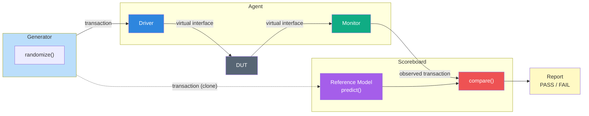
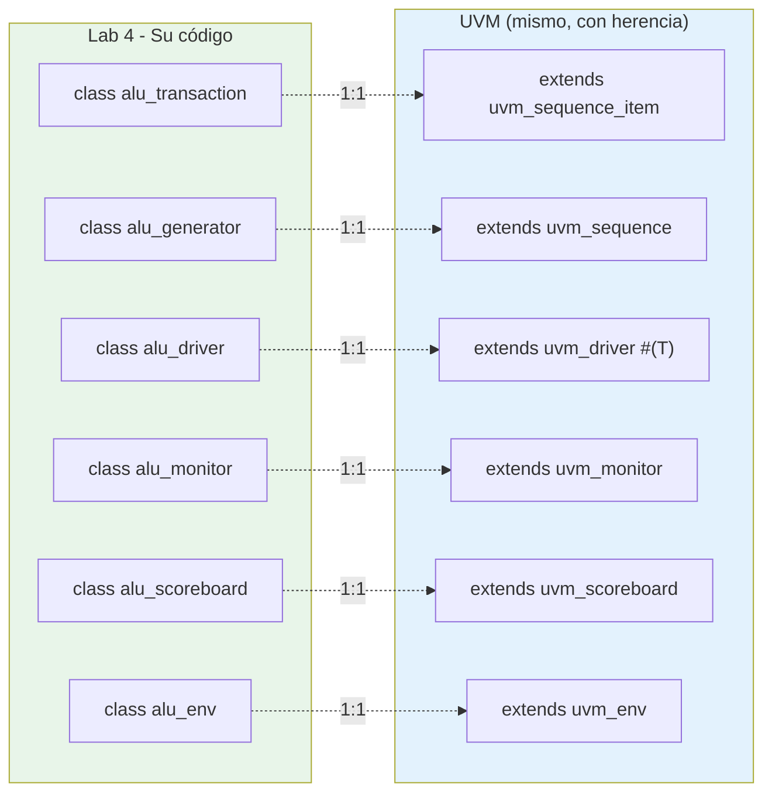
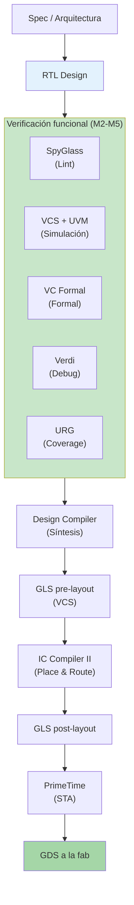

# Mapa conceptual del curso

Este documento contiene el mapa mental completo del curso en formato Mermaid. Se puede imprimir en A3 para colgar en el aula, o proyectar como resumen del último slide del curso.

## Mapa mental (mindmap)

```mermaid
mindmap
  root((Functional<br/>Verification))
    Motivación
      Costo del bug
        Pre-tape-out: minutos
        Post-tape-out: millones
      Verification Gap
        Complejidad exponencial
        TBs manuales no escalan
      70 pct del esfuerzo
        Más verif que RTL
        Mercado laboral amplio
    Anatomía TB
      Reloj y Reset
      Estímulo
      Observación
      Checker
      Reference Model
      Reporte
    Cuatro Pilares
      Constrained Random
        rand / randc
        constraint
        dist
        seed
      Functional Coverage
        covergroup
        coverpoint
        bins
        cross
      Assertions SVA
        property
        assert
        cover
        bind
      Reference Model
        Golden model
        predict()
    Arquitectura OO
      Transaction
      Generator
      Driver
      Monitor
      Scoreboard
      Environment
      Agent
      Pegamento
        mailbox
        virtual interface
        fork join none
    UVM
      Fases
        build
        connect
        run
        report
      Factory
        type override
      Config DB
        set / get
      TLM
        analysis port
        seq item port
      Reporting
        uvm info
        uvm error
        uvm fatal
    Herramientas
      Simulación
        VCS
        Verdi
      Análisis
        SpyGlass
        VC Formal
        URG
      Implementación
        Design Compiler
        IC Compiler II
        PrimeTime
```

## Flujo de datos en un testbench moderno



## De su Lab 4 a UVM (mapeo directo)



## Flujo ASIC — dónde encaja verificación



## Instrucciones para el instructor

Este mapa se puede:

1. **Proyectar en la última slide del M7** como resumen visual
2. **Imprimir en A3 o A2** y colgar en el aula durante todo el curso
3. **Regalar en PDF** a los estudiantes como material de referencia
4. **Usar como diagnóstico durante el curso**: al final de cada módulo, señalar en el mapa qué acabamos de cubrir

Para generar el PDF de este mapa, usar Mermaid Live Editor (`https://mermaid.live`) o exportar directamente desde Slidev.
