# Functional Verification

## Curso Propedéutico

<div class="mt-8 text-sm opacity-80">
  <p>CINVESTAV Zacatenco · Departamento de Ingeniería Eléctrica</p>
  <p>Instructor: <strong>Ing. Cesar Otamendi</strong></p>
  <p>Duración: 6 horas · Preparatorio al Bootcamp Synopsys</p>
</div>

<div class="abs-br m-6 flex gap-2 text-xs opacity-60">
  <span>Presiona <kbd>Space</kbd> para avanzar</span>
</div>

<!--
Presentación del curso (2 minutos):

- Bienvenida cálida. Este NO es un curso de UVM todavía.
- Objetivo: llegar al Bootcamp con la MENTALIDAD correcta.
- Regla del aula: si algo no se entiende, se para. Es un curso propedéutico,
  no una carrera contra el reloj.
- Verificación es 70% del esfuerzo de un chip moderno. Vale la pena entenderlo bien.

Duración total: 6 horas con un break intermedio de 15 min.
-->

---
layout: two-cols
---

# ¿Qué van a llevarse hoy?

Al terminar estas 6 horas ustedes van a poder responder — sin dudar — preguntas como:

- ¿Por qué existe Functional Verification?
- ¿Qué problema resuelve UVM?
- ¿Qué hacen VCS, Verdi, Design Compiler?
- ¿Qué es un `driver`, un `monitor`, un `scoreboard`?
- ¿Qué diferencia un `code coverage` de un `functional coverage`?
- ¿Cómo viajan los datos dentro de un testbench moderno?

::right::

<div class="pl-8">

## Lo que NO van a aprender hoy

- Sintaxis completa de UVM
- Macros avanzadas, factory override, RAL
- Sequences complejas
- Uso profundo de las herramientas Synopsys

<div class="pro-tip mt-4">
Eso es el Bootcamp de la próxima semana. Hoy construimos la <b>intuición</b>. Sin intuición sólida, el Bootcamp se siente como aprender chino en dos días.
</div>

</div>

<!--
Recalcar: hoy es MAPA, no ejecución. La ejecución viene la próxima semana.
El error clásico es aventar a los estudiantes a UVM sin este puente conceptual.
Nosotros vamos a construir el puente.
-->

---
layout: default
---

# Agenda de las 6 horas

<div class="text-sm">

| Módulo | Tema | Duración |
|--------|------|----------|
| **M0** | Kick-off y quiz diagnóstico | 15 min |
| **M1** | ¿Por qué existe Functional Verification? | 45 min |
| **M2** | Anatomía de un testbench | 60 min |
| **M3** | Los 4 pilares de la verificación moderna | 75 min |
| ☕ | **Break** | 15 min |
| **M4** | Construyendo UVM a mano — sin UVM | 90 min |
| **M5** | Ahora sí: ¿qué es UVM? | 60 min |
| **M6** | El flujo ASIC y el ecosistema Synopsys | 30 min |
| **M7** | Cierre, quiz final, puente al Bootcamp | 15 min |

</div>

<div class="mt-4 pro-tip">
La estrella del curso es <b>M4</b>. Ahí van a construir con sus manos las piezas que UVM organiza. Cuando lleguen a <b>M5</b> van a decir <i>"¡ah, UVM solo empaqueta lo que ya hice!"</i>
</div>

<!--
Timing crítico:
- Si M1 se alarga (siempre pasa por la discusión de "cuánto cuesta un bug"),
  recortar de M6, NO de M4.
- El break es sagrado. 15 min completos. Los estudiantes procesan mejor.
-->

---
layout: section
---

<div class="module-badge">MÓDULO 0 · 15 min</div>

# Kick-off y Diagnóstico

## Antes de arrancar, veamos qué saben ya

<!--
Objetivo del módulo 0: crear ambiente, poner el diagnóstico, y establecer
la analogía-ancla del curso (DUT = fábrica, verificación = calidad).
-->

---
layout: default
---

# Quiz diagnóstico rápido (10 min)

Respondan por escrito o mentalmente. No hay calificación — es solo para calibrar el arranque.

<div class="text-sm mt-4">

1. En Verilog, ¿qué diferencia hay entre `reg` y `wire`?
2. Dibuja mentalmente un testbench para un `mux 2-a-1`. ¿Qué señales manejas?
3. ¿Qué es una máquina de estados finita?
4. Si un `if` dentro de `always @(*)` no tiene `else`, ¿qué pasa?
5. En tus palabras: ¿qué es un FPGA?
6. ¿Alguna vez encontraste un bug en tu diseño **después** de sintetizar? ¿Cómo lo encontraste?
7. ¿Qué hace la palabra clave `initial`?
8. Si tu diseño tiene 32 entradas binarias, ¿cuántas combinaciones posibles existen?

</div>

<QuestionBox>
Pregunta abierta al aula: <b>¿Cuántas combinaciones probaron en su último testbench?</b>
</QuestionBox>

<!--
El punto de la pregunta 8 es que digan "4 mil millones" y del silencio
saquen ellos mismos la conclusión de que probar todo es imposible.
Esa es la semilla emocional del curso completo.

Timing: 8-10 min para responder, 2 min para comentar en voz alta.
-->

---
layout: default
---

# La analogía-ancla del curso

<div class="two-col mt-8">

<div>

## El DUT es una fábrica 🏭

- Recibe **materia prima** (inputs)
- La transforma con **procesos internos** (lógica)
- Entrega **producto terminado** (outputs)

Todo lo demás — el testbench, el checker, el coverage — es la **infraestructura de calidad** que rodea a la fábrica.

</div>

<div>

## ¿Y la verificación?

- **QA** que revisa cada lote
- **Auditores** que comparan contra especificación
- **Sensores** que vigilan que nada se salga de rango
- **Reportes** que documentan qué se probó y qué no

</div>

</div>

<Analogy>
Sin QA, una fábrica puede producir 10 millones de piezas defectuosas antes de que alguien se dé cuenta. En silicon, ese error cuesta <b>~10 millones de dólares</b> por respin.
</Analogy>

<!--
Esta analogía se va a repetir MUCHAS veces en el curso.
Cada vez que introducimos una pieza nueva (driver, monitor, scoreboard),
la ubicamos dentro de esta fábrica.

- Driver → operario que alimenta la línea
- Monitor → cámara de seguridad
- Scoreboard → auditor externo
- Coverage → hoja de verificación de QA
- Assertion → alarma anti-incendios
-->

---
layout: section
---

<div class="module-badge">MÓDULO 1 · 45 min</div>

# ¿Por qué existe Functional Verification?

## Los números que nadie enseña en la carrera

<!--
Este módulo es EMOCIONAL antes que técnico. El objetivo es que el estudiante
sienta el peso económico y humano de un bug en silicio, y entienda por qué
la industria invierte tanto en verificación.

Si al final de M1 dicen "wow, esto es serio", ganamos.
-->

---
layout: default
---

# El costo real de un bug en silicio

<div class="two-col mt-6">

<div>

## Bug en FPGA

- Cambias el RTL
- Recompilas: 10 minutos
- Reprogramas la board: 30 segundos
- **Costo: café + tiempo**

## Bug en ASIC ya fabricado

- Necesitas **rediseñar el mask set**
- Volver a fabricar: 3–6 meses
- **Costo: $5M – $50M USD**
- Pierdes ventana de mercado

</div>

<div>

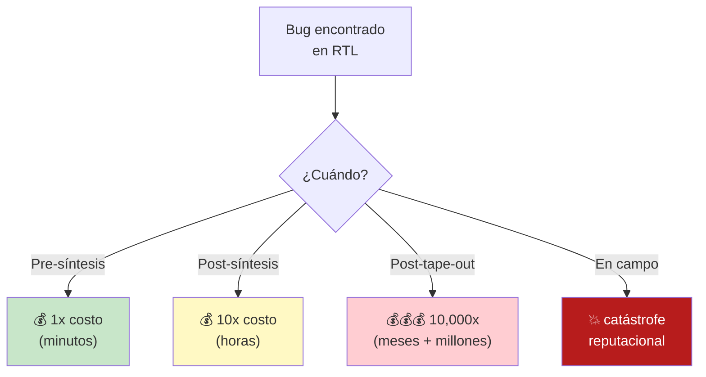

</div>

</div>

<Analogy>
Un bug encontrado antes del tape-out cuesta como <b>corregir un typo antes de imprimir un libro</b>. Después del tape-out, cuesta como <b>llamar a devolver 100,000 libros ya distribuidos en librerías</b>.
</Analogy>

<!--
Casos famosos que se pueden mencionar:
- Pentium FDIV bug (1994): $475M USD para Intel
- ARM Cortex-A9 errata: cambios de silicon en varias tandas
- NVIDIA Fermi respin: retraso de 6 meses

No profundizar, solo mencionar para dar peso. Los estudiantes googlean después.
-->

---
layout: default
---

# La "Verification Gap"

## El problema estructural que da origen a toda esta disciplina

<div class="mt-6">

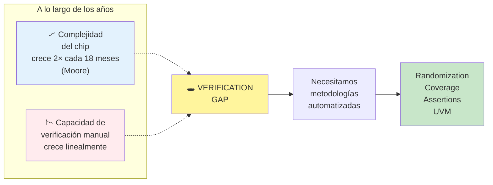

</div>

<QuestionBox>
Si tu diseño tiene <b>32 entradas</b>, hay <b>4,294,967,296</b> combinaciones posibles. A 1 μs por simulación son <b>~71 minutos</b>. Con 64 entradas serían <b>584,542 años</b>. ¿Se puede probar todo?
</QuestionBox>

<!--
Momento clave. Aquí les cae el veinte de que "probar todo" es imposible
y por eso la disciplina inventó otras estrategias:
- Constrained random en vez de exhaustivo
- Coverage en vez de "todos los casos"
- Assertions en vez de checks manuales

Este slide justifica TODO lo que viene después. Volverán a él mentalmente.
-->

---
layout: default
---

# El 70% que nadie ve

## Distribución típica del esfuerzo en un proyecto ASIC moderno

<div class="mt-6">

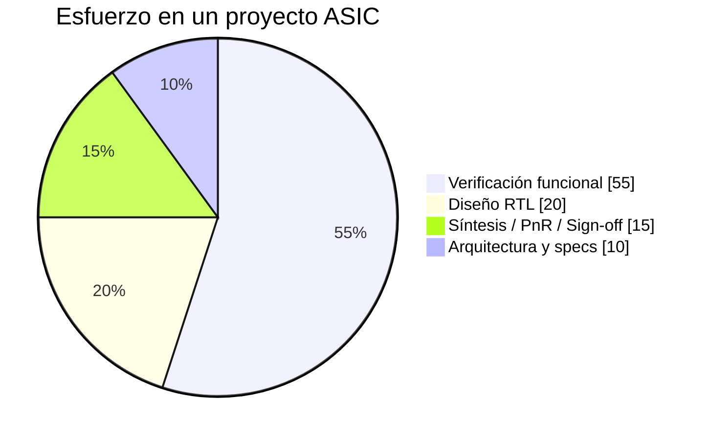

</div>

<div class="text-sm mt-4">

**Fuente:** *Wilson Research Group / Siemens EDA Functional Verification Study*, edición 2022.

- El equipo de verificación es **más grande** que el equipo de diseño en la mayoría de compañías.
- Un verification engineer senior gana **igual o más** que un design engineer senior.
- La escasez de talento en verificación es **peor** que en RTL design.

</div>

<div class="pro-tip">
Cuando ustedes salgan al mercado laboral, van a competir por posiciones de <b>Design Verification Engineer</b> — y hay muchas más vacantes que de RTL.
</div>

<!--
Cierre motivacional del bloque económico. Ahora que entienden POR QUÉ,
podemos hablar de CÓMO.

Preguntar al aula: "¿Cuántos habían escuchado que verificación era la
mayor parte del esfuerzo?" Casi ninguno levanta la mano. Ese es el punto.
-->

---
layout: default
---

# FPGA testing vs. ASIC verification

## No son lo mismo. Y la diferencia importa mucho.

<div class="text-sm">

| Aspecto | FPGA testing (lo que ya hacen) | ASIC verification (lo que van a aprender) |
|---------|-------------------------------|-------------------------------------------|
| **Iteración** | Recompilar en minutos | Un solo tape-out; no hay segunda oportunidad barata |
| **Estímulos** | Directed, escritos a mano | Constrained random + coverage-driven |
| **Detección** | Ver LEDs, oscilo, ILA | Automatizada: scoreboard + assertions |
| **Escala del TB** | Un `initial begin` con 20 líneas | Ambiente OO con miles de líneas |
| **Metodología** | Ad-hoc, cada quien la suya | Estandarizada: UVM (IEEE 1800.2) |
| **Métrica de "listo"** | "Ya prende el LED" | Functional coverage al 100% |
| **Herramientas** | Vivado / Quartus + ModelSim | VCS + Verdi + VC Formal + SpyGlass |
| **Costo del bug** | Recompilar | Millones de dólares |

</div>

<Analogy>
FPGA testing es como <b>probar una receta en tu cocina</b>. ASIC verification es como <b>certificar que una fábrica va a producir 10 millones de latas de comida sin envenenar a nadie</b>.
</Analogy>

<!--
Este slide es clave para NO ofender el conocimiento previo del estudiante.
Su experiencia de FPGA es válida y útil — solo hay que expandirla.

Recalcar: no es que FPGA testing esté "mal". Es que ASIC verification
es una liga distinta con estándares mucho más altos.
-->

---
layout: default
---

# ¿Por qué un testbench manual ya no basta?

<div class="two-col mt-4">

<div>

## Testbench manual clásico

```verilog
initial begin
  a = 4'b0000; b = 4'b0001; #10;
  a = 4'b0001; b = 4'b0010; #10;
  a = 4'b0011; b = 4'b0100; #10;
  // ... 20 líneas más ...
  $finish;
end
```

**Problemas:**
- Solo prueba lo que el ingeniero **imaginó**
- Los bugs viven en los casos **no imaginados**
- No hay métrica de "qué tanto probé"
- No escala: ¿y si son 200 señales?

</div>

<div>

## Lo que necesitamos

- 🎲 Estímulos **aleatorios pero razonables** (constrained random)
- 📊 Métrica objetiva de **qué se probó** (coverage)
- 👮 Reglas que se vigilan **solas** (assertions)
- 🧾 Comparación automática contra un **modelo de referencia**
- 🔁 Poder correr **millones de escenarios sin escribir cada uno**

</div>

</div>

<Gotcha>
Un TB manual con 50 casos directed no encuentra el bug que ocurre cuando <code>a=0xFF</code> llega <b>exactamente</b> un ciclo antes de que <code>reset</code> se libere y <code>b</code> sea impar. Ese caso <b>nunca lo escribes a mano</b> — pero constrained random lo encuentra en la simulación #3,712.
</Gotcha>

<!--
Este slide siembra los 4 pilares que veremos en M3:
- Constrained random
- Coverage
- Assertions
- Reference model

Menciónenlos aquí de pasada. Volveremos a ellos en detalle.
-->

---
layout: default
---

# Ejemplo real: los bugs que sí importan

## No son los que crees

<div class="text-sm mt-4">

**Bugs fáciles** (los que encuentras con un TB manual):
- Reset no funciona
- Un `case` sin `default`
- Bit de signo mal manejado

**Bugs difíciles** (los que solo encuentras con verificación moderna):
- El pipeline se rompe cuando llegan **3 stall consecutivos** con la cache miss al vuelo
- El árbitro pierde una request si **dos masters** piden en **el mismo ciclo** que se libera un semáforo
- El FIFO reporta `full` un ciclo tarde solo cuando se llenó por un **write burst tras un flush parcial**
- La FSM se atora en un estado inalcanzable solo con esta **secuencia exacta** de 47 eventos

</div>

<QuestionBox>
¿Cuántas veces creen que un ingeniero humano escribiría a mano la secuencia exacta de <b>47 eventos</b> del último bug? Respuesta: <b>cero</b>. Por eso existe la verificación aleatoria dirigida.
</QuestionBox>

<!--
Este slide es el más "adulto" del módulo. Los estudiantes salen entendiendo
que los bugs REALES no se encuentran leyendo el RTL — se encuentran corriendo
millones de escenarios aleatorios con checkers automáticos.

Ese es el corazón de la verificación moderna.
-->

---
layout: default
---

# Resumen del Módulo 1

<div class="mt-6">

## Lo que quedó claro (esperamos)

1. Un bug post-tape-out cuesta **millones de dólares** — por eso invertimos tanto en verificación
2. Existe una **verification gap**: la complejidad crece exponencial, nuestra capacidad de escribir TBs no
3. Verificación es el **~70%** del esfuerzo de un proyecto ASIC moderno
4. FPGA testing y ASIC verification son **ligas distintas**
5. Los bugs interesantes **no** los encuentras con un `initial begin` — necesitas otra metodología

</div>

<div class="mt-6 pro-tip">
En el siguiente módulo vamos a abrir el capó de un testbench: qué piezas tiene, qué hace cada una, y por qué la anatomía es la misma sin importar la escala.
</div>

<QuestionBox>
Antes de avanzar: <b>¿Alguna pregunta o duda del módulo 1?</b>
</QuestionBox>

<!--
Pausa deliberada. Si nadie pregunta, TÚ preguntas:
"¿Alguien puede explicarme con sus palabras qué es la verification gap?"

Si la respuesta es sólida, seguimos. Si no, repites el slide del gap.
No pases a M2 con dudas abiertas de M1.

Timing acumulado: 60 min (15 M0 + 45 M1). Vamos en tiempo.
-->

---
layout: end
---

# Fin del Módulo 1

## Siguiente: Anatomía de un testbench

<div class="mt-8 text-sm opacity-70">
Vamos a las piezas concretas. Con código.
</div>

---
layout: section
---

<div class="module-badge">MÓDULO 2 · 60 min</div>

# Anatomía de un testbench

## Las seis piezas universales, sin importar la escala

<!--
M2 arranca aterrizado en código. Los estudiantes ya vieron POR QUÉ (M1);
ahora ven QUÉ hay dentro de un TB.

La tesis del módulo: sin importar si es un TB de 20 líneas o de 20,000,
las piezas son las mismas seis. Cambia la organización, no la esencia.
Esto siembra M4 (donde construyen las piezas OO) y M5 (donde UVM las organiza).
-->

---
layout: default
---

# El testbench que ya conocen

Este es el testbench que probablemente escribieron en sus cursos de FPGA:

```verilog
`timescale 1ns/1ps
module tb;
    logic clk = 0;
    logic rst_n, enable, up_down;
    logic [3:0] count;

    contador dut (.clk(clk), .rst_n(rst_n), .enable(enable),
                  .up_down(up_down), .count(count));

    always #5 clk = ~clk;

    initial begin
        rst_n = 0; enable = 0; up_down = 1;
        #20 rst_n = 1;
        #10 enable = 1;
        #100 $finish;
    end
endmodule
```

<QuestionBox>
Sin ver el código otra vez: ¿cuántas piezas conceptualmente distintas identifican en este testbench?
</QuestionBox>

<!--
Dar 90 segundos para que respondan. Respuestas típicas: "estímulos, reloj,
DUT". La mayoría se les escapa el checker (no hay) y el reporte (solo $finish).
Ese es exactamente el punto: los TB clásicos están incompletos.
-->

---
layout: default
---

# Las seis piezas universales

Todo testbench — desde el más simple hasta uno UVM de 50,000 líneas — se compone de estas seis piezas. Cambia el empaquetado, no la función.

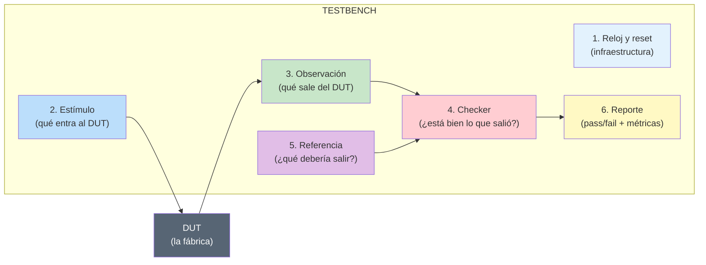

<Analogy>
Piensen en una <b>prueba de manejo</b>. Reloj/reset = las reglas de tiempo y punto de partida. Estímulo = el examinador que da instrucciones. DUT = el candidato manejando. Observación = las cámaras del auto. Checker = el examinador comparando con reglamento. Referencia = el reglamento oficial. Reporte = el acta final: aprobado o reprobado.
</Analogy>

<!--
Este diagrama es LA imagen mental que queremos que se lleven del curso.
Volverán a él varias veces. En M4 lo van a implementar pieza por pieza
con classes. En M5 verán que UVM la reimplementa con nombres formales.
-->

---
layout: default
---

# Pieza 1 — Reloj y reset

## Infraestructura temporal del testbench

<div class="two-col mt-4">

<div>

**Reloj**
- Casi todo diseño digital moderno es síncrono
- El TB debe generar un reloj estable antes que cualquier otra cosa
- Regla: inicializar la variable, luego togglearla

```verilog
initial clk = 1'b0;
always #5 clk = ~clk;  // 100 MHz
```

**Reset**
- Puede ser síncrono o asíncrono (distinta lógica)
- Activo-bajo o activo-alto (convención local)
- Duración típica: al menos 2 ciclos completos

```verilog
initial begin
  rst_n = 1'b0;
  repeat (2) @(posedge clk);
  rst_n = 1'b1;
end
```

</div>

<div>

<div class="gotcha">
Olvidar el <code>initial clk = 1'b0;</code> es el error #1 en labs de primer año. Sin él, <code>~clk</code> siempre da <code>x</code> y el TB nunca arranca. En Verdi se ve como un waveform completamente rojo.
</div>

<div class="pro-tip mt-4">
En proyectos reales, el reloj se genera en un <b>clocking block</b> o dentro de una <b>interface</b> — lo veremos en M4. Por ahora, un <code>always #5</code> alcanza.
</div>

</div>

</div>

<!--
Este slide es el más "código básico". Si el aula lo domina, avanzar rápido.
Si hay dudas, aprovechar para preguntar quién ha visto un waveform con clk=x.
La mayoría dice que sí y se ríe. Es un rite of passage.
-->

---
layout: default
---

# Pieza 2 — Estímulo

## Qué hacemos entrar al DUT

Es la parte más "creativa" del TB — y la más peligrosa. En un TB directed, cada estímulo lo escribimos a mano:

```verilog
initial begin
  // Cinco cuentas hacia arriba
  repeat (5) begin
    @(negedge clk);
    enable  = 1'b1;
    up_down = 1'b1;
  end
  // Tres cuentas hacia abajo
  repeat (3) begin
    @(negedge clk);
    up_down = 1'b0;
  end
end
```

<div class="two-col mt-4">

<div>

**Ventajas de estímulos directed**
- Exactamente el escenario que quieres
- Fácil de debuggear
- Bueno para casos límite conocidos
- Bueno para regression suites de bugs pasados

</div>

<div>

**Desventajas**
- Solo pruebas lo que imaginas
- Escala mal (miles de líneas para un DUT mediano)
- Baja diversidad de estímulos
- No exploras el espacio combinatorio

</div>

</div>

<Analogy>
Directed es como <b>estudiar con guía</b>: sabes exactamente qué preguntas van a caer. Constrained random (M3) es como <b>estudiar el temario completo</b>: no controlas qué te preguntan pero cubres todo.
</Analogy>

---
layout: default
---

# Pieza 3 — Observación

## Cómo sabemos qué está haciendo el DUT

En un TB tradicional, "observar" es casi trivial: las salidas están conectadas al TB y podemos leerlas con `$display`. Pero conceptualmente ya es una **pieza distinta**:

```verilog
always @(posedge clk) begin
  $display("t=%0t count=%0d", $time, count);
end
```

<div class="mt-4">

Esta es la semilla del **Monitor** que veremos en M4. Su trabajo:

- Observar el DUT **sin modificarlo** (nunca escribe entradas)
- Convertir la actividad de bajo nivel (bits en el bus) a información de alto nivel (transacciones, eventos)
- Publicar lo que ve para que el checker lo consuma

</div>

<Analogy>
El monitor es una <b>cámara de seguridad</b>: mira todo, no toca nada, y envía las grabaciones a quien deba revisarlas.
</Analogy>

<QuestionBox>
En el TB del contador, ¿el monitor observa una <b>señal individual</b> (<code>count</code>) o una <b>transacción</b> (un evento tipo "hubo una cuenta hacia arriba con enable=1")? En un TB moderno queremos lo segundo. ¿Por qué es más útil?
</QuestionBox>

<!--
Respuesta esperada: porque una "transacción" tiene contexto y es comparable
contra un modelo de referencia. Una señal aislada no dice si el DUT está bien.

Este es un puente conceptual clave hacia M4.
-->

---
layout: default
---

# Pieza 4 — Checker

## La pregunta central: ¿está bien lo que salió?

<div class="mt-4">

Sin checker, un TB solo demuestra que **el DUT no explota**. No demuestra que hace lo correcto.

Un checker rudimentario a mano:

```verilog
logic [3:0] expected = 0;
int errores = 0;

always @(posedge clk) begin
  if (rst_n && enable)
    expected <= up_down ? expected + 1 : expected - 1;
end

always @(posedge clk) begin
  #1;  // dejar propagar
  if (count !== expected) begin
    $display("[ERROR] count=%0d esperado=%0d", count, expected);
    errores++;
  end
end
```

</div>

<div class="pro-tip">
La variable <code>expected</code> es un <b>reference model en miniatura</b>. En un DUT complejo (una CPU, un decodificador H.264), el reference model es un modelo <b>C++, Python o SystemVerilog</b> que reproduce la funcionalidad del DUT y el checker compara ciclo a ciclo. En M4 llamaremos a esto <b>scoreboard</b>.
</div>

<!--
Si no hay checker, el TB es DECORATIVO. Es una de las cosas que más
sorprende a los estudiantes: "escribí 200 líneas y no verifico nada".

Esa realización motiva todo M3 y M4.
-->

---
layout: default
---

# Pieza 5 — Referencia (Golden / Reference Model)

## ¿Qué debería salir del DUT?

<div class="two-col mt-4">

<div>

**Reference Model** = una implementación **independiente** de la especificación funcional. Sirve como "verdad" contra la cual comparar.

**Formas típicas:**
- Variable simple (como `expected` del slide anterior)
- Función/task en SystemVerilog
- Modelo en C/C++ vía DPI
- Modelo en Python vía cocotb
- Modelo comportamental en SV separado del RTL

</div>

<div>

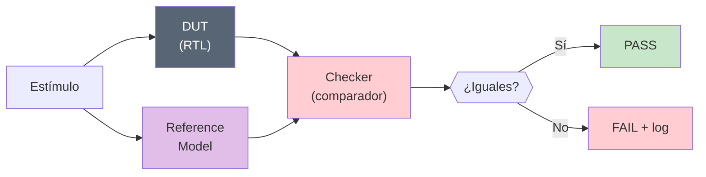

</div>

</div>

<Analogy>
El reference model es el <b>profesor que ya resolvió el examen</b>. El DUT es el <b>alumno</b>. El checker es el <b>calificador</b> que compara respuesta por respuesta. Si difieren, alumno reprueba (bug en RTL) — <i>o</i> el profesor está mal (bug en el reference).
</Analogy>

<div class="gotcha">
En proyectos reales, cuando difieren <b>hay que investigar cuál está mal</b>. A veces es el reference. Esos días son frustrantes pero son parte del trabajo.
</div>

---
layout: default
---

# Pieza 6 — Reporte y terminación

## Cómo cerramos la simulación con conclusiones claras

<div class="mt-4">

Un TB profesional siempre termina con un reporte legible por humanos **y** por scripts CI/CD:

```verilog
final begin
  $display("=========================================");
  $display("[TB] Transacciones probadas: %0d", num_trans);
  $display("[TB] Errores: %0d", errores);
  $display("[TB] Coverage alcanzado: %.1f%%", $get_coverage());
  if (errores == 0)
    $display("[TB] RESULTADO: PASS");
  else
    $display("[TB] RESULTADO: FAIL");
  $display("=========================================");
end
```

</div>

<div class="mt-4">

**Elementos importantes:**
- **Watchdog:** si algo se atora, terminar con `$finish` tras un timeout
- **Formato parseable:** los CI systems buscan strings como `RESULTADO: PASS`
- **Códigos de salida:** `$finish(0)` vs `$finish(1)` distingue OK de fallo
- **Log estructurado:** separadores visuales facilitan el debug post-mortem

</div>

<div class="pro-tip">
En UVM esto se automatiza con el <code>uvm_report_server</code>. Ustedes solo escriben <code>`uvm_info</code>, <code>`uvm_error</code>, y el framework hace el reporte final. Otro ejemplo de <b>UVM organizando lo que ya haríamos a mano</b>.
</div>

---
layout: default
---

# SystemVerilog para verificación — una probadita

## No es Verilog + azúcar; es un lenguaje distinto para verificar

<div class="text-sm mt-4">

Verilog es para **diseñar**. SystemVerilog **para verificación** agrega construcciones que serían absurdas en RTL:

| Construcción | Para qué sirve | Ejemplo mental |
|--------------|----------------|----------------|
| `class`, `virtual`, `extends` | Programación OO en el TB | Un `driver` es una clase |
| `randomize()`, `constraint` | Estímulos aleatorios controlados | "Generar `addr` entre 0 y 4095, alineado a 4" |
| `covergroup`, `coverpoint` | Métrica objetiva de qué se probó | "¿Probamos todos los opcodes?" |
| `assert property`, `cover property` | Reglas temporales que se vigilan solas | "REQ nunca sin GNT en ≤3 ciclos" |
| `interface`, `modport`, `clocking` | Empaquetar buses y sincronización | El bus AXI-Lite es una interface |
| `mailbox`, `semaphore`, `event` | Comunicación entre procesos del TB | El generator manda transacciones al driver |
| `program` block | Región del scheduler libre de races con RTL | El TB "vive" en un program block |

</div>

<QuestionBox>
De todo esto, ¿algo ya vieron en su carrera? La mayoría dice que <code>class</code> les suena de C++/Java, pero jamás lo aplicaron a hardware. Ese es exactamente el shift mental que hacemos hoy.
</QuestionBox>

<!--
NO enseñar sintaxis todavía. Solo sembrar: "esto existe, sirve para X".
En M3 y M4 lo aterrizamos con código real. Aquí solo el mapa mental.
-->

---
layout: default
---

# Interface — el pegamento del testbench

## Empaquetar todas las señales de un bus en un solo objeto

<div class="two-col mt-4">

<div>

**Sin interface (Verilog clásico):**

```verilog
module tb;
  logic clk, rst_n, enable, up_down;
  logic [3:0] count;

  contador dut (.clk(clk), .rst_n(rst_n),
                .enable(enable), .up_down(up_down),
                .count(count));
endmodule
```

Cambia una señal y actualizas 20 archivos.

</div>

<div>

**Con interface (SV moderno):**

```verilog
interface cnt_if (input logic clk);
  logic rst_n, enable, up_down;
  logic [3:0] count;

  modport DUT (input clk, rst_n, enable, up_down,
               output count);
  modport TB  (input clk, count,
               output rst_n, enable, up_down);
endinterface

module tb;
  logic clk = 0;
  cnt_if vif(clk);
  contador dut (.clk(vif.clk), .rst_n(vif.rst_n), ...);
endmodule
```

Una fuente de verdad.

</div>

</div>

<Analogy>
Una interface es como un <b>arnés de cables</b> en un auto: en vez de 40 cables sueltos, tienes un solo mazo que conectas con un conector único. Si cambia el mazo, cambias un solo conector, no 40.
</Analogy>

<div class="pro-tip">
En M4 vamos a usar interface + <code>virtual interface</code> para conectar las clases OO al DUT. Es el mecanismo que UVM usa también.
</div>

---
layout: default
---

# Laboratorio 1 — Testbench directed

<div class="module-badge">20 min · labs/lab1_tb_directed</div>

## Objetivo

Completar un testbench directed para un contador 4-bit up/down. Identificar las seis piezas universales en el código real.

<div class="two-col mt-4">

<div>

**Archivos**
- `contador.sv` — DUT (dado)
- `tb_starter.sv` — TB con TODOs
- `tb_solution.sv` — solución (no abrir hasta terminar)
- `run.sh` — compila y corre con VCS

**Pasos**
1. Abrir `tb_starter.sv`
2. Completar TODO #1 (reloj)
3. Completar TODO #2 (estímulos y reset)
4. TODO #3 opcional (monitor rudimentario)
5. Correr con `./run.sh starter`
6. Comparar con `./run.sh`

</div>

<div>

**Errores comunes que van a encontrar**
- Olvidar `initial clk = 1'b0;`
- Aplicar estímulos en `posedge` en lugar de `negedge`
- No terminar con `$finish`
- Comparar con `==` en lugar de `!==`

**Preguntas para reflexionar mientras codean**
- ¿Cuántos escenarios están probando en total?
- ¿Qué tan probable es que este TB encuentre un bug que solo aparece en overflow?
- ¿Qué pasaría si tuvieran que escribir esto para un DUT con 32 salidas?

</div>

</div>

<!--
Timing: 15 minutos de código + 5 minutos de discusión.

Durante el lab: pasear por el aula. Los que terminan rápido probablemente
copiaron la solución. Preguntarles: "explícame por qué usaste negedge aquí".
Si no saben, hicieron cargo culto.

Al final del lab, discutir en voz alta las preguntas de la derecha. Son
la rampa emocional hacia M3.
-->

---
layout: default
---

# Post-lab: lo que acaban de sentir

## Si hicieron el lab bien, deberían haber tenido estas sensaciones

<div class="mt-6 text-sm">

1. **"Esto lo he hecho mil veces."** Sí — para diseños chicos, este TB alcanza. El punto es identificar que las seis piezas ya estaban ahí, aunque nadie las hubiera nombrado.

2. **"Este TB solo prueba lo que yo pensé probar."** Correcto. Ese es el límite estructural de todos los TB directed.

3. **"El checker es la parte más frágil."** Sí. Escrito a mano, se rompe cada vez que cambia la spec. Necesitamos automatizarlo.

4. **"Para un DUT complejo esto no escala."** Exacto. Un procesador RISC-V con 200 instrucciones necesitaría un `case` de 200 ramas solo en el checker. Insostenible.

</div>

<div class="mt-6">

**Todas estas frustraciones son legítimas.**

Son exactamente las que llevaron a la industria a inventar las herramientas del **Módulo 3**:

- Randomización dirigida → resuelve "solo lo que yo pensé"
- Coverage → resuelve "¿cuánto probé realmente?"
- Assertions → resuelve "el checker frágil"
- Reference model → resuelve "no escala"

</div>

<QuestionBox>
Antes de M3: ¿alguien tuvo un momento durante el lab de <i>"debería haber una mejor manera de hacer esto"</i>?
</QuestionBox>

<!--
Si nadie levanta la mano, presionar: "¿en serio nadie? Porque yo llevo 10
años en esto y todavía siento esa frustración cuando escribo directed TBs".

El chiste es normalizar la frustración como motor de aprendizaje.
-->

---
layout: default
---

# Resumen del Módulo 2

<div class="mt-6">

**Lo que quedó claro**

1. Todo testbench tiene **seis piezas universales**: reloj/reset, estímulo, DUT, observación, checker, referencia, reporte.
2. En un TB directed clásico, las piezas existen pero están **entrelazadas** en el mismo `initial begin`. Nadie las separa.
3. **SystemVerilog para verificación** trae construcciones que Verilog no: classes, randomize, covergroups, assertions, interfaces, mailboxes.
4. Una `interface` empaqueta todas las señales de un bus y evita el infierno de listas de puertos.
5. Los TB directed son útiles pero **estructuralmente limitados**: solo prueban lo que el ingeniero imaginó.

</div>

<div class="mt-6 pro-tip">
En el siguiente módulo levantamos el techo: cuatro técnicas modernas que resuelven las cuatro frustraciones que sintieron en el lab.
</div>

<!--
Timing acumulado esperado al final de M2: 2 h. Vamos en tiempo.
Chequeo verbal: "¿alguien necesita repasar algo antes de M3?"
Si nadie, avanzar. Si alguien duda, aprovechar 3-4 min para aclarar.
-->

---
layout: end
---

# Fin del Módulo 2

## Siguiente: los cuatro pilares de la verificación moderna

<div class="mt-8 text-sm opacity-70">
Constrained random, coverage, assertions, reference model. Con demos y código.
</div>

---
layout: section
---

<div class="module-badge">MÓDULO 3 · 75 min</div>

# Los cuatro pilares de la verificación moderna

## Constrained Random · Coverage · Assertions · Reference Model

<!--
Módulo más denso conceptualmente del curso. La ventaja: cada pilar se justifica
a partir de una frustración concreta del Lab 1 que ya sintieron.

Timing:
- Pilar 1 (Constrained Random) → 20 min + Lab 2 (20 min) = 40 min
- Pilar 2 (Coverage) → 15 min
- Pilar 3 (Assertions) → 15 min + Lab 3 (25 min combinado con Coverage) = 40 min
- Pilar 4 (Reference Model) → 10 min
- Cierre/matriz → 5 min

El Lab 3 se hace DESPUÉS de introducir Coverage Y Assertions, no en medio.
-->

---
layout: default
---

# Panorama del módulo

Los cuatro pilares resuelven las cuatro frustraciones del Lab 1:

<div class="text-sm mt-4">

| Frustración del Lab 1 | Pilar que la resuelve | Qué es |
|---------------------|----------------------|--------|
| "Solo pruebo lo que imaginé" | **Constrained Random** | Estímulos aleatorios controlados por reglas |
| "No sé qué tanto probé" | **Functional Coverage** | Métrica objetiva de escenarios visitados |
| "El checker manual es frágil" | **Assertions (SVA)** | Reglas temporales vigiladas por el simulador |
| "No escala a DUTs grandes" | **Reference Model** | Modelo independiente que dicta lo esperado |

</div>

<div class="mt-6 pro-tip">
Estos cuatro pilares NO son opcionales en un flujo profesional. Un TB moderno los usa todos, siempre. UVM es la manera de organizarlos limpiamente.
</div>

---
layout: section
---

<div class="module-badge">PILAR 1 · 20 min</div>

# Constrained Random

## Estímulos aleatorios, pero con reglas

---
layout: default
---

# La idea central de Constrained Random

<div class="two-col mt-4">

<div>

**Directed testing**
```verilog
apply(a=1, b=2);
apply(a=5, b=7);
apply(a=0, b=0);
// ... 100 líneas más
```
Pruebas exactamente lo que escribes. Y solo eso.

**Constrained Random**
```verilog
class txn;
  rand int a, b;
  constraint c { a inside {[0:255]};
                 b inside {[0:255]};
                 a + b < 500; }
endclass
repeat (10_000) txn.randomize();
```
Pruebas **10,000 combinaciones distintas** que satisfacen tus reglas. En 6 líneas.

</div>

<div>

<Analogy>
Directed es <b>escoger cada estampa del álbum a mano</b>: te llevas horas y siempre olvidas las difíciles. Constrained Random es <b>comprar sobres al azar</b>: en pocos sobres tienes la mayoría, y las pocas que faltan las cazas al final con directed.
</Analogy>

<div class="pro-tip mt-4">
En proyectos reales, la regla es: <b>90% constrained random, 10% directed</b> para forzar corner cases específicos que la aleatoriedad tarda en encontrar.
</div>

</div>

</div>

<!--
Insistir en que constrained random NO significa "totalmente al azar".
El "constrained" es TAN importante como el "random":
- 100% random: probarías direcciones no alineadas, opcodes inválidos, etc. Basura.
- 100% directed: solo pruebas lo que imaginaste.
- Constrained random: aleatorio DENTRO de lo legal según la spec.
-->

---
layout: default
---

# La sintaxis mínima que necesitan hoy

<div class="text-sm">

```verilog
class cnt_txn;
    rand bit enable;           // rand → sortear cada randomize()
    rand bit up_down;
    rand int repeticiones;

    constraint c_reps {
        repeticiones inside {[1:5]};        // rango cerrado
    }

    constraint c_dist {
        enable dist { 1 := 80, 0 := 20 };   // 80% enable=1
    }
endclass

// Uso:
cnt_txn t = new();
int ok = t.randomize();
assert (ok);  // siempre chequear el retorno
```

</div>

<div class="two-col mt-4 text-sm">

<div>

**Palabras clave**
- `rand` — se resortea en cada `randomize()`
- `randc` — cíclico: agota valores antes de repetir
- `inside {A, B, [C:D]}` — pertenencia
- `dist { A := w1, B := w2 }` — pesos relativos
- `->` — implicación (`if_a -> then_b`)

</div>

<div>

**Randomize con constraints inline**
```verilog
t.randomize() with {
    enable == 1;
    up_down == 1;
    repeticiones inside {[3:5]};
};
```
Agrega constraints solo para esta llamada.

</div>

</div>

---
layout: default
---

# Reproducibilidad: la seed importa

## Sin seeds documentadas, un bug de hoy no se reproduce mañana

<div class="mt-4">

```bash
# Cada corrida con seed distinta genera un PATRÓN distinto de estímulos
./simv +ntb_random_seed=1     # patrón A
./simv +ntb_random_seed=42    # patrón B  ← si aquí encontramos un bug...
./simv +ntb_random_seed=42    # patrón B  ← reproducible bit-a-bit
```

</div>

<div class="mt-6 text-sm">

**Práctica profesional:**
- Cada regression corre con **cientos o miles de seeds** distintas
- Las seeds "problemáticas" (las que encontraron bugs) se guardan en un `regression_list.txt`
- Nightly regressions añaden **nuevas seeds** al pool para explorar espacio nuevo
- Cuando encuentran un bug, guardan la seed exacta para bisect posterior

</div>

<div class="gotcha">
Nunca corran una regression sin especificar seed. VCS elige una seed automática que cambia entre corridas y hace <b>irreproducibles</b> los fallos.
</div>

---
layout: default
---

# Laboratorio 2 — Constrained Random

<div class="module-badge">20 min · labs/lab2_random_constraints</div>

## Objetivo

Reemplazar los estímulos directed del Lab 1 por una `class cnt_txn` con `rand` fields, `constraint` blocks y un ciclo que llame `randomize()` 200 veces. Prueben con seeds distintas y observen que los patrones cambian.

<div class="two-col mt-4 text-sm">

<div>

**Pasos**
1. Completar TODO #1 — definir `class cnt_txn`
2. Completar TODO #2 — ciclo de 200 iteraciones con `randomize()`
3. Correr con `./run.sh starter`
4. Comparar con `./run.sh`
5. Probar `./run.sh seed 42` y `./run.sh seed 100`

**Éxito del lab:**
- 200 transacciones aplicadas sin errores
- Diferentes seeds producen patrones visiblemente distintos en el waveform

</div>

<div>

**Lo que van a sentir**
- Antes: "escribo 100 líneas para probar 10 casos"
- Ahora: "escribo 15 líneas y pruebo cientos de casos"
- Y todavía tenemos un pero: **¿cómo sé si probé algo interesante?**

Ese pero es el pilar 2.

</div>

</div>

<!--
Timing: 15 min de código + 5 min discusión.

Durante el lab, hacer notar que si abren el waveform en Verdi verán que
el patrón temporal es TOTALMENTE distinto entre seed=1 y seed=42.
Eso es visual e impactante.
-->

---
layout: section
---

<div class="module-badge">PILAR 2 · 15 min</div>

# Functional Coverage

## Cómo medir "qué tanto probé"

---
layout: default
---

# El problema: ¿cuándo paro de probar?

<div class="mt-6">

Después del Lab 2 tienen esta situación:

- Corren 200, 500, 10,000 transacciones aleatorias
- Todas pasan
- **¿Está listo el DUT? ¿O se están perdiendo escenarios importantes?**

Sin una métrica objetiva, la respuesta es "no sé". Y "no sé" no vende chips.

</div>

<Analogy>
Terminar de verificar sin coverage es como estudiar para un examen <b>sin saber qué temas caen</b>. Puedes estudiar 100 horas y saltarte el capítulo que vale el 40% de la nota.
</Analogy>

<QuestionBox>
En su Lab 2, ¿cuántas veces creen que <code>count</code> tomó el valor <code>4'b1111</code>? ¿Y el valor <code>4'b0000</code>? Sin coverage, es adivinar. Con coverage, es un número exacto.
</QuestionBox>

---
layout: default
---

# Code Coverage vs Functional Coverage

<div class="text-sm mt-4">

| Tipo | Qué mide | Cómo se activa | ¿Automático? |
|------|----------|----------------|---------------|
| **Line** | Qué líneas del RTL se ejecutaron | VCS `-cm line` | Sí |
| **Branch** | Qué ramas de `if`/`case` se tomaron | VCS `-cm branch` | Sí |
| **Toggle** | Qué señales cambiaron 0↔1 | VCS `-cm tgl` | Sí |
| **FSM** | Qué transiciones de estado ocurrieron | VCS `-cm fsm` | Sí |
| **Condition** | Qué combinaciones de operandos booleanos | VCS `-cm cond` | Sí |
| **Functional** | Qué **escenarios de la spec** se probaron | `covergroup` en el TB | **No** |

</div>

<div class="mt-6">

**Ejemplo canónico del problema:**

Un ALU tiene esta línea: `if (op == ADD) result = a + b;`

- **Line coverage:** ejecutas la línea con `a=1, b=2` una vez → 100%
- **Functional coverage:** ¿probaste `a+b` con overflow? ¿Con signo negativo? ¿Con cero? Line coverage no lo sabe. Functional coverage sí.

</div>

<div class="pro-tip">
Regla de la industria: <b>Line coverage 100% es necesario pero no suficiente. Functional coverage 100% (o cerca) es la meta real.</b>
</div>

---
layout: default
---

# Anatomía de un covergroup

<div class="text-sm mt-4">

```verilog
covergroup cg_contador @(posedge clk);       // ← cuándo samplear
    option.per_instance = 1;

    cp_count: coverpoint count {              // ← qué señal medir
        bins low     = {[0:3]};              // ← agrupamientos conceptuales
        bins mid     = {[4:11]};
        bins high    = {[12:15]};
        bins zero    = {0};
        bins max_val = {15};
    }

    cp_dir: coverpoint up_down iff (enable) { // ← solo cuando enable=1
        bins up   = {1};
        bins down = {0};
    }

    cross_cd: cross cp_count, cp_dir;        // ← combinaciones
endgroup

cg_contador cg_h;
initial cg_h = new();                        // ← instanciar
```

</div>

<div class="mt-4 text-sm">

**Piezas conceptuales:**
- **coverpoint** — una señal cuya distribución queremos medir
- **bins** — categorías conceptuales del dominio de esa señal
- **cross** — combinaciones entre coverpoints (el más potente)
- **iff (cond)** — solo contar cuando la condición aplica
- **sample event** — el evento que dispara la medición (aquí: cada `posedge clk`)

</div>

---
layout: default
---

# La potencia real está en `cross`

<div class="mt-4">

**Sin cross:**
- "Visité el valor `count=15`" — bien
- "Visité `up_down=1`" — bien
- ¿Visité `count=15` mientras estaba contando **hacia arriba**? **No lo sé.**

**Con cross:**
```verilog
cross_cd: cross cp_count, cp_dir;
```
Ahora midimos las **12 combinaciones** posibles:
- (low, up), (low, down)
- (mid_low, up), (mid_low, down)
- ... etc.

</div>

<div class="pro-tip mt-4">
Los bugs interesantes viven en las <b>combinaciones</b> de estado, no en valores individuales. Por eso <code>cross</code> es donde vive el 80% del valor de un covergroup profesional.
</div>

<Analogy>
Un coverpoint solo es como saber que un estudiante <b>respondió preguntas de física y de química</b>. Un cross te dice si <b>respondió preguntas de "termodinámica con problemas numéricos"</b> — combinaciones específicas de subtemas.
</Analogy>

---
layout: default
---

# Coverage-driven verification: el loop

<div class="mt-6">

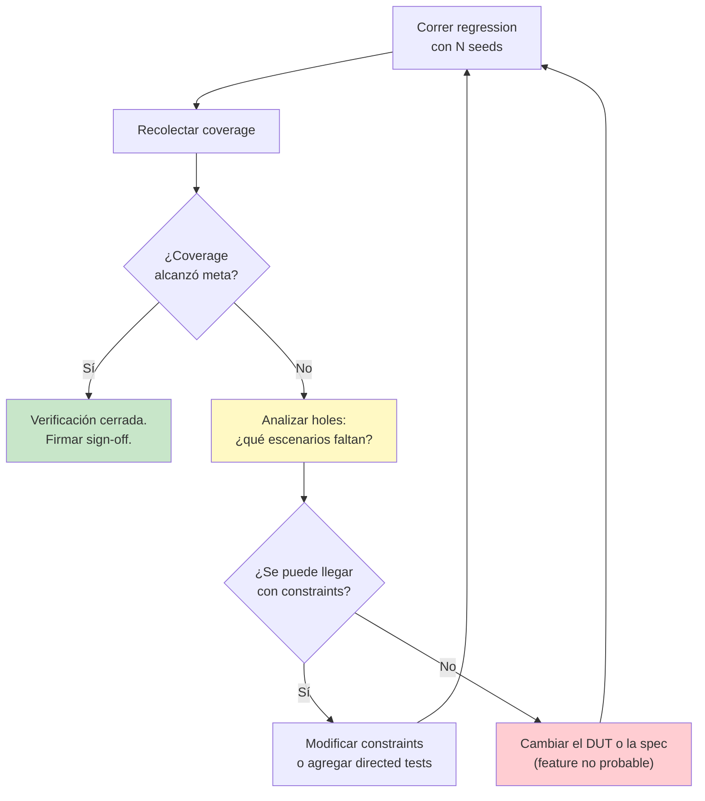

</div>

<div class="mt-4">

Este loop es el **latido diario** de un equipo de verificación. Nightly regressions corren miles de seeds, el reporte de coverage se revisa a la mañana siguiente, se ajustan constraints, se agregan directed tests para los holes, y se vuelve a correr.

</div>

---
layout: section
---

<div class="module-badge">PILAR 3 · 15 min</div>

# Assertions (SVA)

## Reglas temporales vigiladas por el simulador

---
layout: default
---

# ¿Qué es una assertion?

<div class="mt-4">

Una assertion es una **regla del protocolo** escrita en un lenguaje que el simulador entiende. El simulador la vigila **en cada ciclo** y avisa si se rompe.

</div>

<div class="two-col mt-4">

<div>

**Sin assertions**
- Escribo un checker manual en `always @(posedge clk)`
- Lleva ~30 líneas por regla
- Debug: leer waveforms buscando la anomalía
- Cambia la spec, cambia el checker

</div>

<div>

**Con assertions (SVA)**
- Escribo la regla en 1-2 líneas
- El simulador me avisa el ciclo exacto en que se rompió
- El mensaje incluye qué property y por qué
- Cambia la spec, cambio una property

</div>

</div>

<Analogy>
Un checker manual es un <b>guardia leyendo un manual mientras camina</b>: lento, se cansa, se distrae. Una assertion es un <b>sensor automático de alarma</b>: siempre alerta, siempre reporta, nunca se cansa.
</Analogy>

---
layout: default
---

# Sintaxis básica de SVA

<div class="text-sm mt-4">

```verilog
property p_reset_clears_count;
    @(posedge clk) (!rst_n) |-> (count == 4'b0000);
endproperty

a_reset: assert property (p_reset_clears_count)
    else $error("[SVA] count=%0d durante reset", count);
```

**Traducción a humano:** *"En cada posedge de clk, si rst_n está bajo, entonces count debe ser cero."*

</div>

<div class="mt-4 text-sm">

**Operadores temporales esenciales:**

| Operador | Significado | Ejemplo |
|----------|-------------|---------|
| `|->` | Implicación mismo ciclo | `req |-> gnt` |
| `|=>` | Implicación siguiente ciclo | `req |=> gnt` |
| `##N` | Delay de N ciclos | `req ##2 ack` |
| `##[a:b]` | Delay entre a y b ciclos | `req ##[1:3] ack` |
| `$past(x)` | Valor de x en ciclo pasado | `x == $past(x) + 1` |
| `$stable(x)` | x no cambió respecto ayer | `!en |=> $stable(count)` |
| `$rose(x)` / `$fell(x)` | Flanco de subida/bajada | `$rose(req) |-> ##1 gnt` |
| `disable iff (c)` | Deshabilitar durante c | `disable iff (!rst_n)` |

</div>

---
layout: default
---

# Ejemplo aplicado al contador

<div class="text-sm mt-4">

```verilog
// P1: durante reset, count debe ser 0
property p_reset;
    @(posedge clk) (!rst_n) |-> (count == 0);
endproperty
assert property (p_reset) else $error("count=%0d durante reset", count);

// P2: con enable=0 (y sin reset), count no cambia
property p_hold;
    @(posedge clk) disable iff (!rst_n) (!enable) |=> $stable(count);
endproperty
assert property (p_hold) else $error("count cambió con enable=0");

// P3: con enable=1 y up_down=1, count aumenta en 1
property p_increment;
    @(posedge clk) disable iff (!rst_n)
        (enable && up_down) |=> (count == $past(count) + 1);
endproperty
assert property (p_increment)
    else $error("count=%0d, esperado=%0d", count, $past(count)+1);
```

</div>

<div class="pro-tip">
Estas 3 assertions <b>reemplazan</b> ~50 líneas de checker manual — y son más precisas: dan el ciclo exacto del fallo con contexto (<code>$past</code>).
</div>

---
layout: default
---

# `cover property` — el hermano de `assert`

<div class="mt-4">

`cover property` no vigila que algo **no** ocurra: le dice al simulador *"quiero ver que este escenario **sí** ocurra"*.

```verilog
c_overflow:  cover property (
    @(posedge clk) (count == 4'b1111) ##1 (count == 4'b0000)
);
```

**Traducción:** "en algún momento, `count` valió 15 y en el siguiente ciclo valió 0" — es decir, ocurrió un overflow.

</div>

<div class="mt-4">

**Al final de la simulación, el reporte dice:**
- `c_overflow`: **covered** (bien, sí probamos overflow)
- o `c_overflow`: **not covered** (mal, aumentar iteraciones o cambiar constraints)

</div>

<div class="pro-tip">
<code>cover property</code> es complementario a <code>covergroup</code>: covergroup mide valores/combinaciones; cover property mide <b>secuencias temporales</b>. Ambos son parte de functional coverage.
</div>

---
layout: default
---

# `bind` — cómo enganchar assertions al DUT sin tocarlo

<div class="mt-4">

```verilog
// En el testbench, FUERA de todo module:
bind contador checker_sva u_sva (.*);
```

**Traducción:** "instala una instancia del módulo `checker_sva` **dentro** de cada instancia del `contador`, conectando puertos por nombre."

</div>

<div class="mt-4 text-sm">

**Ventajas:**
- El RTL del `contador` **no cambia** — misma síntesis, mismo netlist
- Puedes tener múltiples `checker_sva` para distintos aspectos
- Se pueden bindear checkers de terceros (proveedores de IP)
- Fácil deshabilitar en producción sin modificar diseño

</div>

<Analogy>
<code>bind</code> es como poner una <b>cámara externa</b> a una máquina en la fábrica. La máquina no sabe que está siendo grabada. La cámara ve todo lo que entra, sale y ocurre adentro. Puedes quitarla sin tocar la máquina.
</Analogy>

---
layout: default
---

# Laboratorio 3 — Coverage + Assertions

<div class="module-badge">25 min · labs/lab3_coverage_assertions</div>

## Objetivo

Sobre el TB del Lab 2, agregar functional coverage y assertions SVA. Al final generar el reporte HTML de coverage con `urg`.

<div class="two-col mt-4 text-sm">

<div>

**Pasos**
1. TODO #1: definir `covergroup cg_contador` con `cp_count`, `cp_dir`, `cross`
2. Instanciar `cg_h = new()` en el `initial`
3. TODO #2: `bind contador checker_sva u_sva (.*);`
4. Correr `./run.sh cov` → genera reporte URG
5. Correr `./run.sh urg` → abre HTML en navegador
6. Revisar qué bins/crosses quedaron sin cubrir

</div>

<div>

**Éxito del lab**
- Coverage total > 80%
- Todas las cover properties reportadas como "covered"
- Cero fallos de assertion (con la seed default)

**Bonus:** cambiar constraints para llegar a 100% de coverage. Es más difícil de lo que parece.

</div>

</div>

<!--
Timing: 20 min código + 5 min revisar el reporte URG en aula.

El momento HTML del reporte URG es visualmente potente. Mostrarlo proyectado.
Los estudiantes suelen sorprenderse de que "así se ve un reporte real de
verificación" — muy distinto del $display en consola.
-->

---
layout: section
---

<div class="module-badge">PILAR 4 · 10 min</div>

# Reference Model

## La verdad contra la cual comparamos

---
layout: default
---

# Reference Model — formalizando la idea

<div class="mt-4">

Ya vieron el concepto: en el Lab 2 usaron una variable `expected` que actualizaban a mano. Eso **era** un reference model minúsculo.

En un DUT complejo (CPU, códec, controlador USB), el reference model es una **implementación independiente** de la spec funcional:

</div>

<div class="two-col mt-4 text-sm">

<div>

**Formas típicas:**
- **Variable SV** (contador simple)
- **Función/task SV** (ALU, decoder)
- **Class SV separada** (bloque protocolar)
- **C/C++ vía DPI** (procesador, códec)
- **Python vía cocotb** (validación cruzada)
- **Modelo comportamental Verilog** separado

</div>

<div>

**Propiedades importantes:**
- **Independiente** del RTL bajo prueba
- Escrito por otra persona idealmente
- Basado directamente en la spec
- No optimizado para velocidad — optimizado para claridad
- Se valida contra pruebas doradas antes de usarse

</div>

</div>

<Analogy>
El reference es el <b>profesor que ya resolvió el examen antes</b>. Cuando el alumno (DUT) entrega su respuesta, se compara contra la del profesor. Si difieren, o el alumno está mal, o el profesor está mal — y hay que investigar cuál.
</Analogy>

---
layout: default
---

# Reference model en el flujo del testbench

<div class="mt-4">

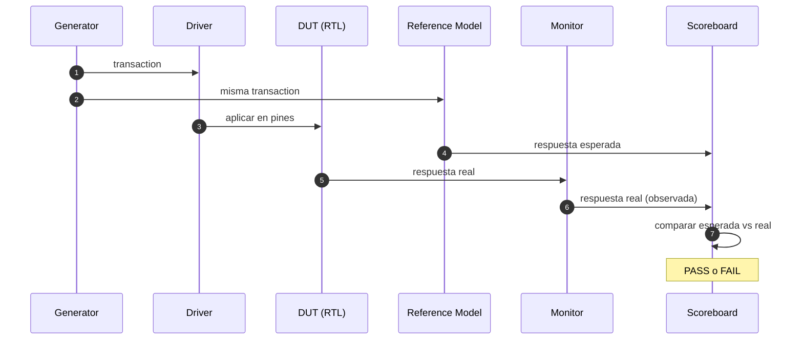

</div>

<div class="mt-4">

**El diagrama de arriba es la anatomía completa** de un testbench moderno. Estas son las piezas que vamos a construir en el Módulo 4 — cada una como su propia `class`.

</div>

---
layout: default
---

# Matriz: qué bug encuentra cada técnica

<div class="text-sm mt-4">

| Tipo de bug | Directed | Constrained Random | Coverage | Assertions | Reference Model |
|-------------|----------|-------------------|----------|------------|-----------------|
| Caso obvio de la spec | Excelente | Bueno | N/A | Bueno | Excelente |
| Corner case previsto | Excelente | Regular | Excelente para medir | Bueno | Excelente |
| Corner case imprevisto | Nulo | Excelente | Detecta ausencia | Nulo | Excelente |
| Violación temporal (protocolo) | Regular | Regular | Regular | **Excelente** | Regular |
| Divergencia funcional | Bueno | Bueno | N/A | Regular | **Excelente** |
| Escenario nunca visitado | Nulo | Regular | **Excelente para medirlo** | Nulo | Nulo |
| Race condition | Nulo | Regular | Nulo | **Excelente** | Nulo |

</div>

<div class="mt-4 pro-tip">
Ninguna técnica es completa por sí sola. Un TB profesional usa <b>las cinco</b> — con la mayoría del volumen en Constrained Random + Coverage.
</div>

---
layout: default
---

# Resumen del Módulo 3

<div class="mt-4">

**Los cuatro pilares:**

1. **Constrained Random** — aleatoriedad controlada; 200 transacciones en 15 líneas de código
2. **Functional Coverage** — métrica objetiva de qué escenarios visitamos; `covergroup + cross + urg`
3. **Assertions (SVA)** — reglas temporales vigiladas por el simulador; `property + assert + bind`
4. **Reference Model** — implementación independiente de la spec que dicta lo esperado

**Lo que ganamos con los cuatro:**

- Escala: pruebas miles de escenarios sin escribir cada uno
- Objetividad: medimos qué probamos, no adivinamos
- Automatización: los checkers vigilan solos
- Precisión: el reference dicta la verdad ciclo a ciclo

</div>

<div class="mt-4 pro-tip">
Después del break vamos al Módulo 4 — el corazón del curso. Ahí van a tomar todas estas piezas sueltas y las van a <b>organizar en classes separadas</b>. Y verán que UVM es exactamente esa organización, con nombres formales.
</div>

<QuestionBox>
Antes del break: ¿alguna duda de los 4 pilares?
</QuestionBox>

---
layout: end
---

# Fin del Módulo 3

## Break de 15 minutos

<div class="mt-8 text-sm opacity-70">
Cuando volvamos: construir UVM a mano, sin UVM.
</div>

---
layout: section
---

<div class="module-badge">MÓDULO 4 · 90 min</div>

# UVM a mano, sin UVM

## El módulo más importante del curso

<!--
Este es el módulo estrella. Al final de M4 los estudiantes deben decir:
"¡Ah, UVM solo organiza esto!". Sin ese aha-moment, el curso falla.

Timing:
- Motivación + arquitectura (10 min)
- Recorrido pieza por pieza (35 min)
- Lab 4 (40 min)
- Post-lab: contar líneas + preparar el aha-moment (5 min)
-->

---
layout: default
---

# Lo que traen del break

En los labs 1-3 ya usaron todas las piezas de la verificación moderna:

- Transacciones (`class cnt_txn`) — Lab 2
- Randomización controlada — Lab 2
- Coverage funcional — Lab 3
- Assertions temporales — Lab 3
- Un reference model en línea (variable `expected`) — desde Lab 1

Pero todo esto vivía **mezclado dentro de un solo `initial begin`**. Lo van a separar hoy.

<div class="mt-4 pro-tip">
La tesis del módulo: <b>una arquitectura OO no agrega funcionalidad — agrega orden</b>. El mismo código, organizado en piezas con responsabilidades separadas.
</div>

<QuestionBox>
Antes de arrancar: en el Lab 3, ¿cuántas líneas del <code>initial begin</code> se dedicaban a generar estímulos y cuántas a checkear resultados? Piénsenlo. Van a ver que están entrelazadas.
</QuestionBox>

---
layout: default
---

# La idea central del módulo

Vamos a descomponer el TB en **siete clases**, cada una con **una sola responsabilidad**:

<div class="text-sm mt-4">

| Clase | Responsabilidad única | Analogía |
|-------|----------------------|----------|
| `transaction` | Modelar una operación como un objeto | Un paquete de mensajería |
| `generator` | Producir transacciones aleatorias | El almacén que empaqueta pedidos |
| `driver` | Aplicar transacciones al bus del DUT | El conductor del camión |
| `monitor` | Observar el DUT y reconstruir transacciones | Una cámara de seguridad |
| `scoreboard` | Comparar observado vs. reference model | El auditor externo |
| `environment` | Construir y orquestar todas las piezas | La empresa completa |
| `agent` | Agrupar driver+monitor para un protocolo | El departamento de logística |

</div>

<Analogy>
Piensen en una fábrica de autos. Antes escribíamos un <b>ingeniero-toderas</b> que soldaba, pintaba, empacaba y auditaba, todo en el mismo <code>initial begin</code>. Ahora tenemos <b>siete departamentos</b> — cada uno hace una sola cosa, muy bien.
</Analogy>

---
layout: default
---

# Arquitectura completa del testbench

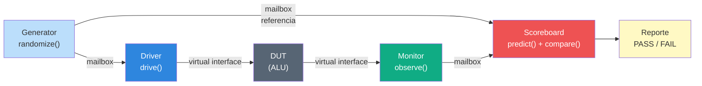

<div class="mt-4 text-sm">

**Tres puentes conectan las piezas:**

- **mailbox #(T)** — canal FIFO tipado, thread-safe, entre clases
- **virtual interface** — puente entre las clases (mundo OO) y el DUT (mundo módulos)
- **environment** — el `main()` que instancia todo y arranca en paralelo con `fork/join_none`

</div>

---
layout: default
---

# El DUT del laboratorio: ALU 4-bit

Un DUT sencillo pero suficientemente rico para justificar la arquitectura completa:

```verilog
module alu (
    input  logic       clk, rst_n,
    input  logic [3:0] a, b,
    input  logic [1:0] op,     // 00=ADD, 01=SUB, 10=AND, 11=OR
    output logic [3:0] result,
    output logic       zero,   // 1 si result == 0
    output logic       carry   // solo válido en ADD
);
```

<div class="two-col mt-4 text-sm">

<div>

**¿Por qué ALU y no contador?**

- Cuatro operaciones distintas → coverage interesante
- Reference model no trivial (más rico que "+1/-1")
- Corner cases genuinos (overflow, zero, wrap)
- Se parece a algo real (parte de un CPU)

</div>

<div>

**Espacio de estímulos**
- `a`: 16 valores
- `b`: 16 valores
- `op`: 4 valores
- **Total: 1,024 combinaciones**

Con 200 random ya cubrimos ~20% del espacio + los corner cases interesantes.

</div>

</div>

---
layout: default
---

# Pieza 1 — Transaction

## El paquete de información que circula por el TB

```verilog
class alu_transaction;
    // Inputs (aleatorizables)
    rand bit [3:0] a;
    rand bit [3:0] b;
    rand bit [1:0] op;

    // Outputs (los llenará el monitor con lo observado)
    bit [3:0] result;
    bit       zero;
    bit       carry;

    function string convert2string();
        return $sformatf("a=%0h b=%0h op=%s -> result=%0h",
                         a, b, op_str(), result);
    endfunction

    function alu_transaction clone();  // copia profunda
        alu_transaction c = new();
        c.a = this.a; c.b = this.b; c.op = this.op;
        c.result = this.result; c.zero = this.zero; c.carry = this.carry;
        return c;
    endfunction
endclass
```

<Analogy>
Una <code>transaction</code> es un <b>sobre de mensajería</b>. Adentro va la información (a, b, op) y una etiqueta para el destinatario. Se puede fotocopiar (<code>clone()</code>) y describirse en texto (<code>convert2string()</code>).
</Analogy>

<div class="pro-tip">
Cuando lleguen al Bootcamp, <code>alu_transaction</code> heredará de <code>uvm_sequence_item</code>. El resto queda casi idéntico.
</div>

---
layout: default
---

# Pieza 2 — Generator

## Fábrica de transacciones aleatorias

```verilog
class alu_generator;
    mailbox #(alu_transaction) gen2drv;  // hacia el driver
    mailbox #(alu_transaction) gen2sb;   // hacia el scoreboard (referencia)
    int num_trans;

    function new(mailbox #(alu_transaction) gen2drv,
                 mailbox #(alu_transaction) gen2sb,
                 int num_trans = 200);
        // ... guardar handles ...
    endfunction

    task run();
        alu_transaction t;
        for (int i = 0; i < num_trans; i++) begin
            t = new();
            assert (t.randomize());
            gen2drv.put(t);           // driver aplica al DUT
            gen2sb.put(t.clone());    // scoreboard compara vs referencia
        end
    endtask
endclass
```

<Analogy>
El generator es el <b>almacén de pedidos</b>: fabrica sobres, los pone en dos cintas transportadoras: una hacia el <b>despachador</b> (driver) y otra hacia el <b>auditor</b> (scoreboard).
</Analogy>

<div class="gotcha">
Notar el <code>clone()</code>: el generator manda una <b>copia</b> al scoreboard. Sin clone, driver y scoreboard compartirían el mismo objeto y se pisarían.
</div>

---
layout: default
---

# Pieza 3 — Driver

## Conductor del bus físico del DUT

```verilog
class alu_driver;
    virtual alu_if             vif;      // handle al interface
    mailbox #(alu_transaction) gen2drv;

    function new(virtual alu_if vif, mailbox #(alu_transaction) gen2drv);
        this.vif     = vif;
        this.gen2drv = gen2drv;
    endfunction

    task run();
        alu_transaction t;
        forever begin
            gen2drv.get(t);           // bloqueante hasta que llegue una
            drive(t);
        end
    endtask

    task drive(alu_transaction t);
        @(vif.cb_tb);                  // sincronizar con clocking block
        vif.cb_tb.a  <= t.a;
        vif.cb_tb.b  <= t.b;
        vif.cb_tb.op <= t.op;
    endtask
endclass
```

<Analogy>
El driver es el <b>conductor del camión</b>: recibe un sobre en la bodega (mailbox), lo carga (<code>drive()</code>), y lo entrega en la dirección del DUT vía la interface. No sabe qué hay adentro del sobre, solo lo entrega.
</Analogy>

---
layout: default
---

# Interface virtual — el puente al DUT

## Cómo las clases (OO) hablan con los modules (RTL)

```verilog
interface alu_if (input logic clk, input logic rst_n);
    logic [3:0] a, b;
    logic [1:0] op;
    logic [3:0] result;
    logic       zero, carry;

    clocking cb_tb @(posedge clk);
        default input #1 output #1;
        output a, b, op;
        input  result, zero, carry;
    endclocking

    modport DRV (clocking cb_tb, input clk, rst_n);
    modport MON (clocking cb_tb, input clk, rst_n);
endinterface
```

<div class="two-col mt-4 text-sm">

<div>

**Clocking block resuelve dos problemas:**
- **Race conditions** — el `#1` de skew garantiza que la clase escribe/lee después del flanco, no en el flanco
- **Sincronización** — `@(vif.cb_tb)` avanza un ciclo determinista

</div>

<div>

**Virtual interface** = handle a una interface en el mundo OO. Se declara así:

```verilog
class alu_driver;
    virtual alu_if vif;
    // ...
endclass
```

Y se conecta al construir el driver.

</div>

</div>

---
layout: default
---

# Pieza 4 — Monitor

## Cámara de seguridad del bus

```verilog
class alu_monitor;
    virtual alu_if             vif;
    mailbox #(alu_transaction) mon2sb;

    function new(virtual alu_if vif, mailbox #(alu_transaction) mon2sb);
        this.vif    = vif;
        this.mon2sb = mon2sb;
    endfunction

    task run();
        alu_transaction t;
        forever begin
            @(vif.cb_tb);
            if (!vif.rst_n) continue;   // ignorar reset

            t = new();
            t.a      = vif.cb_tb.a;
            t.b      = vif.cb_tb.b;
            t.op     = vif.cb_tb.op;
            t.result = vif.cb_tb.result;
            t.zero   = vif.cb_tb.zero;
            t.carry  = vif.cb_tb.carry;

            mon2sb.put(t);              // publicar al scoreboard
        end
    endtask
endclass
```

<Analogy>
El monitor es una <b>cámara de seguridad</b>: mira todo, no toca nada, y envía las grabaciones (transacciones observadas) al auditor. Es <b>pasivo</b> — jamás modifica el DUT.
</Analogy>

<div class="pro-tip">
Diferencia crucial con el driver: el driver escribe entradas y las <b>publica</b>. El monitor lee inputs Y outputs, y arma una transacción <b>completa</b>. El scoreboard usa esta transacción para saber qué hizo el DUT.
</div>

---
layout: default
---

# Pieza 5 — Scoreboard

## Auditor con reference model integrado

```verilog
class alu_scoreboard;
    mailbox #(alu_transaction) gen2sb;   // esperado
    mailbox #(alu_transaction) mon2sb;   // observado
    int num_pass, num_fail;

    // Reference model: la spec traducida a código
    function void predict(alu_transaction t);
        case (t.op)
            2'b00: t.result = t.a + t.b;
            2'b01: t.result = t.a - t.b;
            2'b10: t.result = t.a & t.b;
            2'b11: t.result = t.a | t.b;
        endcase
        t.zero = (t.result == 4'b0);
    endfunction

    task run();
        alu_transaction exp, obs;
        forever begin
            gen2sb.get(exp);      // lo que pedimos
            mon2sb.get(obs);      // lo que salió
            predict(exp);         // calcular lo esperado
            if (exp.result === obs.result) num_pass++;
            else num_fail++;
        end
    endtask
endclass
```

<Analogy>
El scoreboard es <b>el profesor con la clave del examen</b>. Sabe la respuesta correcta (<code>predict()</code>) y la compara contra la del alumno (<code>obs</code>). No enseña, no toma exámenes — solo califica.
</Analogy>

---
layout: default
---

# Pieza 6 — Environment

## El orquestador que une todo

```verilog
class alu_env;
    alu_generator   gen;
    alu_driver      drv;
    alu_monitor     mon;
    alu_scoreboard  sb;

    mailbox #(alu_transaction) gen2drv, gen2sb, mon2sb;
    virtual alu_if vif;

    function void build();
        gen2drv = new(); gen2sb = new(); mon2sb = new();
        gen = new(gen2drv, gen2sb, num_trans);
        drv = new(vif, gen2drv);
        mon = new(vif, mon2sb);
        sb  = new(gen2sb, mon2sb);
    endfunction

    task run();
        fork
            gen.run();  drv.run();  mon.run();  sb.run();
        join_none
        wait (gen2drv.num() == 0 && gen2sb.num() == 0 && mon2sb.num() == 0);
        sb.report();
    endtask
endclass
```

<Analogy>
El environment es <b>el gerente general</b>: no manufactura ni audita, solo <b>construye la empresa</b> (build()) y <b>arranca todos los departamentos en paralelo</b> (run()).
</Analogy>

---
layout: default
---

# Pieza 7 — Agent

## Agrupamiento por protocolo (para más adelante)

En este lab no lo implementamos porque solo tenemos un DUT con un solo bus. Pero conceptualmente:

<div class="mt-4 text-sm">

**Un `agent` agrupa las piezas que hablan el mismo protocolo:**
- driver + monitor + sequencer para el bus AXI
- driver + monitor + sequencer para el bus APB
- driver + monitor + sequencer para el bus AHB

Un DUT complejo (un SoC) tiene **varios agents** — uno por interfaz externa.

</div>

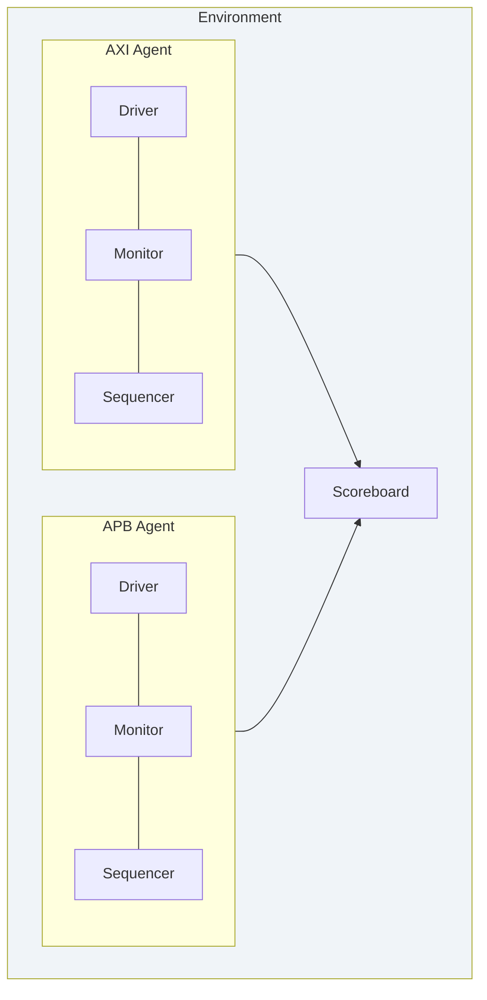

<Analogy>
Un agent es un <b>departamento especializado</b>: el de logística marítima maneja barcos, el de logística terrestre maneja camiones. Comparten el mismo esquema (driver+monitor+sequencer) pero especializado por protocolo.
</Analogy>

---
layout: default
---

# Flujo completo de una transacción

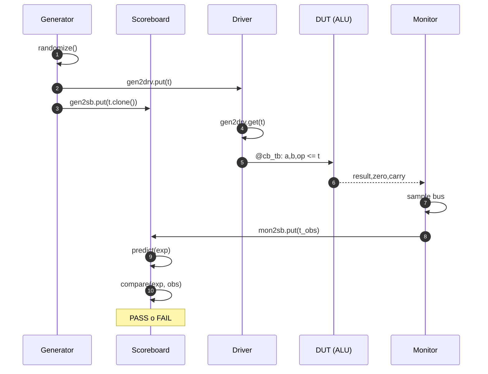

<div class="mt-4 text-sm">

Este diagrama es la **respiración del testbench**. Ocurre una vez por transacción. Con 200 transacciones son 200 ciclos completos del sequence diagram.

</div>

---
layout: default
---

# Laboratorio 4 — Construir la arquitectura completa

<div class="module-badge">40 min · labs/lab4_uvm_a_mano</div>

## Objetivo

Correr un testbench de 7 clases contra la ALU 4-bit. Las clases ya están escritas — solo hay que instanciar el DUT y arrancar el environment en el `tb_top_starter.sv`.

<div class="two-col mt-4 text-sm">

<div>

**Pasos**
1. Explorar los 6 archivos de clases (~15 min de lectura crítica)
2. TODO #1: instanciar el DUT conectado al interface
3. TODO #2: `env = new()`, `env.build()`, `env.run()`
4. Correr `./run.sh starter` → deben ver 200 PASS
5. Bonus: `./run.sh N 10000` → escala linealmente
6. Bonus: inyectar un bug en `alu.sv` y confirmar que el SB lo detecta

</div>

<div>

**Éxito del lab**
- 200 PASS, 0 FAIL con seed=1
- Waveform muestra el bus cambiando cada ciclo
- Escala a 10,000 sin cambios

**Al terminar, comparar con Lab 3:**
- Mismo DUT-equivalente
- Mucho más ordenado
- Testable con miles de transacciones sin cambiar el TB

</div>

</div>

<!--
Este es el lab crítico del curso. NO recortar tiempo aquí.

Durante el lab, pasearse por el aula haciendo preguntas socráticas:
- "¿Dónde vive la aleatoriedad?"
- "¿Si mañana el DUT cambia sus pines, qué archivos toco?"
- "¿Por qué el driver no conoce el reference model?"

Estas preguntas siembran el aha-moment del siguiente slide.
-->

---
layout: default
---

# Post-lab: cuenten sus líneas de código

Después de que su lab pase con 200 PASS, corran:

```bash
wc -l *.sv
```

Verán algo así:

```
   55 transaction.sv
   35 generator.sv
   40 driver.sv
   35 monitor.sv
   80 scoreboard.sv
   55 env.sv
   60 tb_top.sv
   30 alu_if.sv
  ---
  390 total
```

<div class="mt-4">

**Con ~390 líneas construyeron:**
- Randomización controlada
- Reference model
- Auto-checking
- Reporte pass/fail
- Escalable a miles de transacciones
- Modificable con cambios locales

</div>

<QuestionBox>
Sin ver el código: ¿en cuál de los siete archivos vive el <b>reference model</b>? ¿En cuál vive la <b>aleatoriedad</b>? ¿En cuál vive el <b>conocimiento del bus</b>? Respondan mentalmente.
</QuestionBox>

<!--
Las respuestas:
- Reference model → scoreboard.sv
- Aleatoriedad → generator.sv (y las constraints en transaction.sv)
- Conocimiento del bus → driver.sv y monitor.sv (y el interface)

Si responden rápido y bien, entendieron la separación de responsabilidades.
Ese es el aha-moment. UVM formaliza esto.
-->

---
layout: default
---

# Y esto que acaban de construir...

## Se llama UVM

<div class="mt-6">

Lo que hicieron en las últimas dos horas es la **arquitectura de UVM** completa, sin usar UVM.

En el módulo siguiente van a ver que UVM es **exactamente esto**, con:
- Nombres estandarizados (`uvm_sequence_item`, `uvm_driver`, `uvm_env`)
- Infraestructura industrial (factory, config_db, fases)
- Reporting profesional
- Integración con VCS/Verdi/Coverage

Pero la **arquitectura conceptual — la que importa** — ya la tienen.

</div>

<div class="mt-6 pro-tip">
Cuando en el Bootcamp les enseñen <code>class my_driver extends uvm_driver #(my_txn);</code>, ustedes van a decir <i>"ah, es mi <code>alu_driver</code> con herencia"</i>. Y tendrán razón.
</div>

<QuestionBox>
Antes de M5: <b>¿alguien puede resumir en una frase qué hace cada una de las 7 piezas?</b>
</QuestionBox>

---
layout: default
---

# Resumen del Módulo 4

<div class="mt-4">

**Las siete piezas del testbench moderno:**

1. **Transaction** — objeto de datos que circula
2. **Generator** — fábrica de transacciones aleatorias
3. **Driver** — conductor del bus del DUT
4. **Monitor** — cámara pasiva del bus
5. **Scoreboard** — auditor con reference model
6. **Environment** — orquestador que construye y arranca
7. **Agent** — agrupamiento por protocolo (uno por interfaz externa)

**Los tres puentes:**
- `mailbox #(T)` entre clases
- `virtual interface` entre clases y DUT
- `fork/join_none` para paralelismo

**El aha-moment:** todo esto **es** UVM. Solo faltan los nombres formales y la infraestructura industrial. Eso viene en M5.

</div>

<!--
Timing acumulado esperado al final de M4: ~5h 15min.
Nos quedan M5 (60 min) + M6 (30 min) + M7 (15 min) = 1h 45min.
Vamos justos. Si M4 se alarga, recortar de M6 (menos crítico).
-->

---
layout: end
---

# Fin del Módulo 4

## Siguiente: ahora sí, ¿qué es UVM?

<div class="mt-8 text-sm opacity-70">
Van a ver que M5 es un mapeo directo de lo que ya construyeron.
</div>

---
layout: section
---

<div class="module-badge">MÓDULO 5 · 60 min</div>

# Ahora sí: ¿qué es UVM?

## Todo lo que construyeron, con nombres formales

<!--
M5 es el módulo del "traducción". No hay codificación nueva.
Todo el tiempo se dedica a mapear lo del Lab 4 con la nomenclatura UVM.

Timing:
- Historia + qué es UVM (10 min)
- Mapeo directo pieza por pieza (25 min)
- Jerarquía + fases + factory + config_db (20 min)
- Resumen + Q&A (5 min)
-->

---
layout: default
---

# Historia rápida — de dónde viene UVM

<div class="mt-4 text-sm">

| Año | Metodología | Origen |
|-----|-------------|--------|
| 2003 | **VMM** (Verification Methodology Manual) | Synopsys — primer intento serio |
| 2006 | **OVM** (Open Verification Methodology) | Cadence + Mentor |
| 2011 | **UVM 1.0** | Accellera — merge de OVM + VMM |
| 2020 | **UVM 2020-1.2** (IEEE 1800.2) | Estandarizado por IEEE |
| Hoy | **UVM 2020-2.0** | El estándar de facto en la industria |

</div>

<div class="mt-6">

**UVM no es un lenguaje nuevo.** Es una **librería de clases SystemVerilog** que codifica las mejores prácticas de las tres metodologías anteriores. Cualquier simulador comercial (VCS, Xcelium, Questa) la trae preinstalada.

</div>

<Analogy>
UVM es como <b>Standard Template Library (STL) para verificación</b>. C++ tiene <code>std::vector</code>, <code>std::map</code>, etc. — no se reinventan. UVM tiene <code>uvm_driver</code>, <code>uvm_monitor</code>, <code>uvm_env</code> — no se reinventan.
</Analogy>

<!--
Insistir en que UVM NO es un lenguaje. Es un SET de clases.
Escrito 100% en SystemVerilog IEEE 1800.
Se importa así: `import uvm_pkg::*;`
-->

---
layout: default
---

# Lo que UVM agrega sobre lo que ya construyeron

<div class="text-sm mt-4">

| Ya tienen del Lab 4 | UVM le agrega |
|--------------------|---------------|
| Arquitectura de 7 piezas | Nombres estandarizados (`uvm_*`) |
| `mailbox #(T)` entre clases | `uvm_analysis_port` con múltiples subscribers |
| `virtual interface` al DUT | `uvm_config_db` para pasar el handle sin globals |
| `fork/join_none` en `env.run()` | Sistema automático de **fases** (build/connect/run/report) |
| `class extends class` manual | `uvm_factory` — swap de clases sin editar código |
| `$display("[TB]...")` | `uvm_info`, `uvm_warning`, `uvm_error`, `uvm_fatal` con verbosidad |
| Reporte manual con `$display` | `uvm_report_server` automático |
| Nada para registros | `uvm_reg` — modelado y verificación de registros del DUT |

</div>

<div class="mt-4 pro-tip">
Todo esto es <b>infraestructura industrial</b>, no arquitectura. La arquitectura ya la entienden. Lo demás son conveniencias que ahorran miles de líneas de boilerplate en un proyecto grande.
</div>

---
layout: default
---

# Mapeo pieza por pieza — Transaction

<div class="two-col text-sm">

<div>

**Su clase del Lab 4**

```verilog
class alu_transaction;
  rand bit [3:0] a;
  rand bit [3:0] b;
  rand bit [1:0] op;

  bit [3:0] result;
  bit       zero;
  bit       carry;

  function string convert2string();
    return $sformatf("a=%h", a);
  endfunction

  function alu_transaction clone();
    // ... copia manual ...
  endfunction
endclass
```

</div>

<div>

**En UVM**

```verilog
class alu_transaction extends uvm_sequence_item;
  `uvm_object_utils(alu_transaction)

  rand bit [3:0] a;
  rand bit [3:0] b;
  rand bit [1:0] op;

  bit [3:0] result;
  bit       zero;
  bit       carry;

  function new(string name = "alu_txn");
    super.new(name);
  endfunction

  // convert2string(), clone(), copy(), compare()
  // se heredan del framework
endclass
```

</div>

</div>

<div class="mt-3">

**Lo que UVM aporta:** herencia de `uvm_sequence_item` (que trae `clone`, `copy`, `compare`, `pack`/`unpack` gratis) + macro `` `uvm_object_utils `` que la registra en el factory.

</div>

---
layout: default
---

# Mapeo pieza por pieza — Driver

<div class="two-col text-sm">

<div>

**Su clase del Lab 4**

```verilog
class alu_driver;
  virtual alu_if vif;
  mailbox #(alu_transaction) gen2drv;

  function new(virtual alu_if vif,
               mailbox #(alu_transaction) mb);
    this.vif = vif;
    this.gen2drv = mb;
  endfunction

  task run();
    alu_transaction t;
    forever begin
      gen2drv.get(t);
      drive(t);
    end
  endtask
endclass
```

</div>

<div>

**En UVM**

```verilog
class alu_driver extends uvm_driver #(alu_transaction);
  `uvm_component_utils(alu_driver)
  virtual alu_if vif;

  function new(string name, uvm_component parent);
    super.new(name, parent);
  endfunction

  function void build_phase(uvm_phase phase);
    uvm_config_db#(virtual alu_if)::get(
      this, "", "vif", vif);
  endfunction

  task run_phase(uvm_phase phase);
    forever begin
      seq_item_port.get_next_item(req);
      drive(req);
      seq_item_port.item_done();
    end
  endtask
endclass
```

</div>

</div>

<div class="mt-3 pro-tip">
Diferencias clave: fases (<code>build_phase</code> vs <code>new</code>), <code>uvm_config_db</code> reemplaza el argumento del constructor, y <code>seq_item_port</code> reemplaza el mailbox. La <b>lógica de drive() es idéntica</b>.
</div>

---
layout: default
---

# Mapeo pieza por pieza — Monitor

<div class="two-col text-sm">

<div>

**Su clase**

```verilog
class alu_monitor;
  virtual alu_if vif;
  mailbox #(alu_transaction) mon2sb;

  task run();
    alu_transaction t;
    forever begin
      @(vif.cb_tb);
      t = new();
      // ... sample bus ...
      mon2sb.put(t);
    end
  endtask
endclass
```

Un subscriber (el scoreboard).

</div>

<div>

**En UVM**

```verilog
class alu_monitor extends uvm_monitor;
  `uvm_component_utils(alu_monitor)
  virtual alu_if vif;

  uvm_analysis_port #(alu_transaction) ap;

  function void build_phase(uvm_phase phase);
    ap = new("ap", this);
    // ... get vif del config_db ...
  endfunction

  task run_phase(uvm_phase phase);
    forever begin
      @(vif.cb_tb);
      // ... sample ...
      ap.write(t);
    end
  endtask
endclass
```

Múltiples subscribers (SB, coverage, log).

</div>

</div>

<div class="mt-3">

**Aportación clave de UVM:** `uvm_analysis_port` es <b>1-a-N</b> (múltiples subscribers). Un mailbox es 1-a-1. En un TB real, el monitor publica a scoreboard, coverage collector y logger simultáneamente — con analysis_port es una línea.

</div>

---
layout: default
---

# La jerarquía UVM

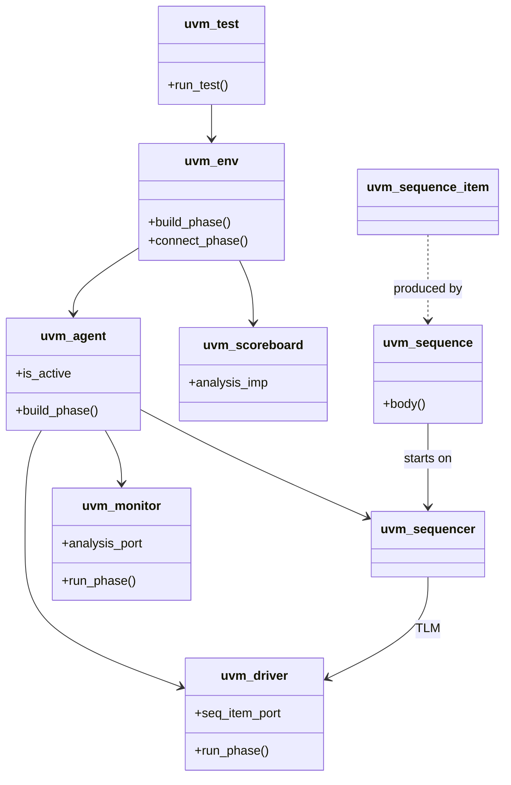

<div class="mt-3 text-sm">

Esta jerarquía es <b>exactamente</b> la del Lab 4 con dos adiciones: <code>uvm_test</code> (arriba) que arranca el env, y <code>uvm_sequencer</code> (dentro del agent) que separa la lógica de "qué generar" (sequence) de "cómo entregar" (sequencer).

</div>

---
layout: default
---

# Las fases de UVM

## Cómo el framework orquesta la vida del testbench

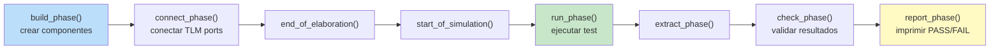

<div class="mt-3 text-sm">

**Fases automáticas del framework — no las llaman ustedes, UVM las llama en orden:**

- **build_phase** — instanciar componentes (era su `env.build()`)
- **connect_phase** — conectar analysis_ports y seq_item_ports (los mailboxes de su lab)
- **run_phase** — la simulación real corre aquí (era su `env.run()` con fork/join_none)
- **check_phase** / **report_phase** — validar y reportar (era su `sb.report()`)

</div>

<div class="pro-tip">
Ustedes en el Lab 4 llamaron <code>build()</code> y <code>run()</code> manualmente. UVM las llama <b>automáticamente</b> en todos los componentes del árbol. Ahorra decenas de líneas de plumbing.
</div>

---
layout: default
---

# Factory — reemplazar clases sin editar código

## La automatización más útil de UVM

<div class="two-col text-sm mt-4">

<div>

**Escenario:** el proyecto usa `alu_driver`. Para un test específico quieren un `alu_driver_with_errors` (inyecta errores). Sin UVM:

```verilog
// Editar env.sv:
alu_driver_with_errors drv;
drv = new(...);
```

Y reeditar para cada test. Insostenible.

</div>

<div>

**Con UVM factory:**

```verilog
// En el env, siempre:
drv = alu_driver::type_id::create("drv", this);

// En el test que quiere el override:
function void build_phase(uvm_phase phase);
  alu_driver::type_id::set_type_override_via_type(
    alu_driver_with_errors::get_type()
  );
  super.build_phase(phase);
endfunction
```

**El env no cambia.** El test decide qué clase se instancia.

</div>

</div>

<Analogy>
Factory es el <b>servicio de reemplazo de partes</b> de UVM. El env pide "un driver" y factory decide cuál entregar según el test. Es <b>polimorfismo</b> — pero configurado desde afuera.
</Analogy>

---
layout: default
---

# config_db — pasar handles sin globals

## Cómo el env le pasa el `virtual interface` al driver

<div class="mt-4 text-sm">

**En el Lab 4** el interface se pasaba como argumento del constructor: `drv = new(vif, mb);`

**En UVM** eso no funciona porque UVM llama `new()` automáticamente sin parámetros del usuario. Solución: **config_db**, una base de datos global tipada.

```verilog
// En el tb_top (fuera de todo componente):
initial begin
  uvm_config_db#(virtual alu_if)::set(null, "*", "vif", tb_vif);
  run_test("alu_test");
end

// Dentro del driver.build_phase():
if (!uvm_config_db#(virtual alu_if)::get(this, "", "vif", vif))
  `uvm_fatal("VIF", "No se pudo obtener virtual interface")
```

</div>

<div class="mt-3">

**Ventajas:**
- No hay variables globales
- El scope se puede restringir (`"*"` global, `"env.agent.*"` local)
- Cualquier componente lo puede consumir sin conocer al productor
- Tipado — el compilador chequea que sean del mismo tipo

</div>

---
layout: default
---

# TLM — comunicación tipada entre componentes

## Los "cables" de UVM entre analysis_ports

<div class="mt-4 text-sm">

**TLM (Transaction-Level Modeling)** es el sistema de comunicación de UVM. Reemplaza a los mailboxes.

```verilog
// En el monitor:
uvm_analysis_port #(alu_transaction) ap;

// En el scoreboard:
uvm_analysis_imp #(alu_transaction, alu_scoreboard) analysis_export;

function void write(alu_transaction t);
  // ... procesa la transacción ...
endfunction

// En el env.connect_phase():
mon.ap.connect(sb.analysis_export);
```

</div>

<div class="mt-3 text-sm">

**Tipos de puertos TLM:**
- **put_port / get_port** — 1-a-1 bloqueante (equivalente a mailbox básico)
- **analysis_port / analysis_imp** — 1-a-N no bloqueante (broadcast)
- **seq_item_port / seq_item_export** — canal sequencer-driver
- **tlm_fifo** — FIFO buffered para desacoplar productor y consumidor

</div>

<div class="pro-tip">
Cuando ustedes vean <code>mon.ap.connect(sb.ap_imp)</code> en el Bootcamp, es el <b>mismo</b> concepto de sus mailboxes del Lab 4 — con broadcast y tipado más estricto.
</div>

---
layout: default
---

# Reporting — cómo hablan los componentes UVM

## Reemplazo profesional de $display

```verilog
`uvm_info  ("SB", $sformatf("txn %0d: PASS", num), UVM_LOW)
`uvm_warning("SB", "Timeout parcial en respuesta")
`uvm_error ("SB", $sformatf("expected=%h observed=%h", exp, obs))
`uvm_fatal ("VIF", "Virtual interface no configurado")
```

<div class="text-sm mt-4">

**Ventajas sobre `$display`:**
- **Verbosidad ajustable en runtime**: `+UVM_VERBOSITY=UVM_HIGH` para debug, `UVM_LOW` para producción
- **Filtrado por componente**: `+uvm_set_verbosity=env.agent.drv,_ALL_,UVM_DEBUG,run`
- **Conteo automático**: al final, el `uvm_report_server` imprime resumen de errores/warnings
- **Formato estándar**: `[UVM_ERROR @ 250ns] SB: expected=... observed=...`
- **`uvm_fatal` termina la simulación** con código de salida distinto de PASS

</div>

<div class="pro-tip">
En CI/CD, un test que emite <b>1+ uvm_error</b> es FAIL automático. En su Lab 4 tuvieron que contar errores manualmente en <code>num_fail</code>. UVM lo hace solo.
</div>

---
layout: default
---

# Un test UVM completo — anatomía mínima

<div class="text-sm mt-4">

```verilog
class alu_test extends uvm_test;
  `uvm_component_utils(alu_test)
  alu_env env;

  function new(string name, uvm_component parent);
    super.new(name, parent);
  endfunction

  function void build_phase(uvm_phase phase);
    super.build_phase(phase);
    env = alu_env::type_id::create("env", this);
  endfunction

  task run_phase(uvm_phase phase);
    alu_sequence seq;
    phase.raise_objection(this);
    seq = alu_sequence::type_id::create("seq");
    seq.start(env.agent.sequencer);
    phase.drop_objection(this);
  endtask
endclass
```

</div>

<div class="mt-3 text-sm">

Comparen con su `initial begin` del Lab 4: `env = new(vif); env.build(); env.run();`. Es literalmente lo mismo con nombres formales. **La `phase.raise_objection` es el mecanismo UVM para decir "todavía no terminen — sigo trabajando"**. Sin ella, `run_phase` termina cuando no hay tareas pendientes.

</div>

---
layout: default
---

# Resumen del Módulo 5

<div class="mt-4">

**Lo que aprendieron:**

1. UVM = librería de clases SystemVerilog (IEEE 1800.2), no un lenguaje nuevo
2. La **arquitectura** de UVM es idéntica a la que construyeron en el Lab 4
3. UVM agrega **infraestructura industrial**: fases automáticas, factory, config_db, TLM, reporting, factory
4. Cada clase suya tiene su equivalente `uvm_*` con la misma responsabilidad
5. La curva de aprendizaje del Bootcamp será **mapear conceptos que ya conocen a nombres nuevos**, no aprender arquitectura nueva

</div>

<div class="mt-4 pro-tip">
Cuando salgan del Bootcamp y escriban <code>class my_driver extends uvm_driver #(my_txn);</code>, van a estar escribiendo su <code>alu_driver</code> del Lab 4 con herencia y factory. La arquitectura ya la dominan.
</div>

<QuestionBox>
Antes de M6: <b>¿pueden nombrar las 4 fases más importantes de un componente UVM?</b>
Respuesta esperada: build, connect, run, report.
</QuestionBox>

---
layout: end
---

# Fin del Módulo 5

## Siguiente: el flujo ASIC completo y las herramientas Synopsys

<div class="mt-8 text-sm opacity-70">
Dónde encaja VCS, Verdi, Design Compiler y las demás.
</div>

---
layout: section
---

<div class="module-badge">MÓDULO 6 · 30 min</div>

# El flujo ASIC y el ecosistema Synopsys

## Dónde encaja cada herramienta en el flujo profesional

<!--
M6 es un módulo de contexto. No hay codificación.
Es "el mapa de la industria" — para que sepan qué hace cada tool
y cómo se conectan.

Timing: rápido, 3-4 min por herramienta.
-->

---
layout: default
---

# El flujo ASIC completo

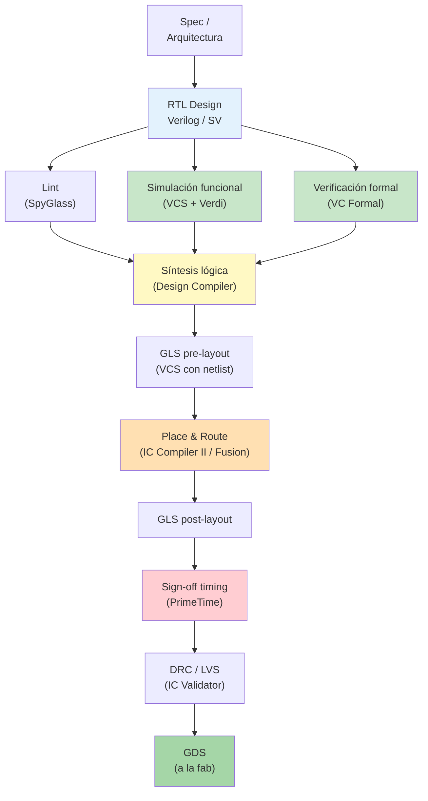

<div class="mt-3 text-sm">

**Ustedes en este curso trabajan en la parte verde: verificación funcional.** El resto es contexto que los ayudará a entender por qué se hace lo que se hace.

</div>

---
layout: default
---

# VCS — el simulador

**Categoría:** Simulador de eventos discretos para Verilog / SystemVerilog / UVM
**Fabricante:** Synopsys
**Rol en el flujo:** el motor sobre el que corren *todos* los testbenches

<div class="mt-4 text-sm">

**Comandos básicos** (ya los usaron en los labs):

```bash
vcs -full64 -sverilog -debug_access+all -kdb -lca -o simv \
    alu.sv alu_if.sv tb_top.sv
./simv +ntb_random_seed=1 +N=200
```

**Flags críticos:**
- `-sverilog` — habilita constructs de SystemVerilog
- `-debug_access+all -kdb` — habilita debug con Verdi
- `-assert svaext` — assertions SVA
- `-cm line+cond+fsm+tgl+branch+assert` — coverage recolectado

</div>

<Analogy>
VCS es el <b>motor de un auto de carreras</b>: sin él nada corre. Todos los demás tools (Verdi, URG, Coverage) son <b>tablero, diagnósticos y telemetría</b> sobre VCS.
</Analogy>

---
layout: default
---

# Verdi — el debug

**Categoría:** Waveform viewer + debugger de RTL
**Fabricante:** Synopsys
**Rol en el flujo:** ver, buscar, entender qué pasó en la simulación

<div class="two-col mt-4 text-sm">

<div>

**Funciones típicas:**
- Ver waveforms de señales (VCD, FSDB)
- Ir del waveform al RTL con click
- Buscar causa raíz de un valor X
- Ver jerarquía del diseño
- Debug de UVM (`fsdbDumpMDA`)
- Coverage viewer integrado

</div>

<div>

```bash
verdi -sv -f alu.sv alu_if.sv tb_top.sv \
  -ssf tb_alu.fsdb &
```

Con el DUT y el FSDB abre la GUI. Se navega entre waveform, source y schematic.

</div>

</div>

<div class="pro-tip">
Verdi es donde vive el 80% del tiempo de un verification engineer. Aprender sus atajos (búsqueda, marcadores, driver tracing) hace la diferencia entre debug de 10 min y de 3 horas.
</div>

---
layout: default
---

# SpyGlass — el linter

**Categoría:** Análisis estático de RTL
**Fabricante:** Synopsys (adquirido de Atrenta)
**Rol en el flujo:** cazar errores <b>antes</b> de simular

<div class="mt-4 text-sm">

**Detecta cosas que la simulación no ve, o ve tarde:**
- Latches inferidos (siempre bug)
- FSMs con estados inalcanzables
- Multi-driven nets
- Signals sin driver
- Convenciones de nomenclatura violadas
- Clock domain crossings problemáticos
- Violaciones de reglas del proyecto (por ejemplo "todos los flip-flops deben tener reset")

</div>

<Analogy>
SpyGlass es el <b>corrector ortográfico</b> del RTL. Simular sin correr lint antes es como publicar un libro sin pasar por el editor — vas a encontrar errores en producción.
</Analogy>

<div class="pro-tip">
En proyectos serios, <b>ningún RTL entra a repository sin pasar SpyGlass limpio</b>. Es política. Los CI systems lo enforçan.
</div>

---
layout: default
---

# VC Formal — verificación formal

**Categoría:** Verificación matemática (no simulación)
**Fabricante:** Synopsys
**Rol en el flujo:** probar propiedades **exhaustivamente** sin correr estímulos

<div class="mt-4 text-sm">

**Diferencia con simulación:**
- **Simulación:** aplicas estímulos, ves qué pasa. Cobertura parcial.
- **Formal:** el tool <b>demuestra matemáticamente</b> que una propiedad se cumple <b>para todos los estímulos posibles</b>.

**Ejemplo:** "El árbitro nunca da acceso a dos masters al mismo tiempo."
- Simulación: pruebas 10,000 escenarios, ninguno falla. ¿Y el escenario 10,001?
- Formal: prueba matemática. Si pasa, es para siempre.

</div>

<Analogy>
Formal es como una <b>demostración de teorema</b>. Simulación es como <b>probar con muchos ejemplos</b>. Formal cubre 100%, simulación cubre lo que probaste.
</Analogy>

<div class="gotcha">
Formal solo escala a diseños pequeños o bloques individuales. Un chip completo <b>no</b> se verifica formalmente — se usa formal en <b>bloques críticos</b> (árbitros, controladores de memoria) y simulación en el resto.
</div>

---
layout: default
---

# Design Compiler — síntesis lógica

**Categoría:** Compilador RTL → gates
**Fabricante:** Synopsys
**Rol en el flujo:** transformar Verilog a una netlist de compuertas lógicas específicas del PDK

<div class="mt-4 text-sm">

**Input:** RTL (`.v`, `.sv`) + constraints (`.sdc`) + librería (`.lib` o `.db`)
**Output:** Netlist gate-level (`.v`) + timing report + área report

**Comando canónico:**

```bash
dc_shell -f run.tcl
```

Donde `run.tcl` tiene `read_verilog`, `read_sdc`, `compile_ultra`, `write`, etc.

**Métricas que reporta:**
- Área total (en μm²)
- Slack (¿cumple el timing pedido en el SDC?)
- Consumo dinámico y estático
- Utilización de cada tipo de celda

</div>

<div class="pro-tip">
Después de sintetizar hay que hacer <b>GLS (Gate-Level Simulation)</b>: correr el TB del Lab 4 pero contra la netlist (no el RTL). Si el TB pasa contra RTL pero falla contra netlist → hay un bug de síntesis o de las constraints.
</div>

---
layout: default
---

# IC Compiler II / Fusion Compiler — Place & Route

**Categoría:** Herramienta de implementación física
**Fabricante:** Synopsys
**Rol en el flujo:** ubicar las celdas físicamente en el chip y rutear las conexiones

<div class="mt-4 text-sm">

**Input:** Netlist de gates + PDK físico + constraints
**Output:** Layout (`.def`, `.gds`) listo para tape-out

**Etapas dentro de PnR:**
1. **Floorplan** — dónde van los bloques principales
2. **Powergrid** — mallas de VDD/VSS
3. **Placement** — dónde va cada celda individual
4. **CTS (Clock Tree Synthesis)** — construir árbol de clock balanceado
5. **Routing** — conectar todas las señales
6. **Sign-off checks** — DRC, LVS, timing

</div>

<Analogy>
Design Compiler es como <b>escribir la receta</b> de un edificio. IC Compiler II es como <b>construirlo físicamente</b>: dónde va cada ladrillo, cómo pasan los cables, dónde están las escaleras.
</Analogy>

---
layout: default
---

# PrimeTime — sign-off de timing

**Categoría:** Static Timing Analysis (STA)
**Fabricante:** Synopsys
**Rol en el flujo:** verificar que **todos los paths** del chip cumplen el timing pedido

<div class="mt-4 text-sm">

**Analiza sin simular**:
- Setup slack (¿llega la señal antes del flanco?)
- Hold slack (¿se mantiene después del flanco?)
- Todos los paths entre flip-flops
- Todas las corners PVT (proceso × voltaje × temperatura)

**Ejemplo de salida:**

```
Startpoint: reg_a/CK  (rising edge triggered flip-flop)
Endpoint:   reg_b/D  (rising edge triggered flip-flop)
Path Group: clk
Path Type: max
Slack (MET): 0.15
```

</div>

<div class="pro-tip">
Sin PrimeTime limpio, no hay tape-out. Es el <b>último checkpoint</b> antes de mandar el chip a fabricar. Un WNS negativo significa que el chip no va a correr a la frecuencia especificada.
</div>

---
layout: default
---

# El ecosistema completo — cómo se conectan

<div class="mt-4 text-sm">

```
                  ┌──────────────────────────────────────┐
                  │        Verification Engineer          │
                  │        (ustedes en 6 meses)          │
                  └──────────────────────────────────────┘
                              │
       ┌──────────────────────┼──────────────────────┐
       ▼                      ▼                      ▼
   [SpyGlass]            [VCS + UVM]           [VC Formal]
   Lint estático         Simulación funcional   Formal
                              │
                              ▼
                          [Verdi]
                          Debug + Coverage
                              │
                              ▼
                          [URG]
                          Reporte de coverage
```

</div>

<div class="mt-4">

**Estas cinco herramientas son el "verification tooling" del proyecto.** El resto (DC, ICC2, PT) las usa el equipo de implementación física.

</div>

<div class="pro-tip">
En un Bootcamp de una semana no verán todas. Van a profundizar en <b>VCS + Verdi + UVM</b>. Las demás las mencionan cuando aplique.
</div>

---
layout: default
---

# Resumen del Módulo 6

<div class="mt-4">

**Herramientas Synopsys y su rol:**

- **VCS** — simulador (motor de todo el flujo de verificación)
- **Verdi** — debug/waveform (donde vive el verification engineer)
- **SpyGlass** — linter estático (previene bugs antes de simular)
- **VC Formal** — verificación formal (prueba matemática)
- **Design Compiler** — síntesis RTL → gates
- **IC Compiler II / Fusion Compiler** — Place & Route
- **PrimeTime** — sign-off timing

**El flujo:** RTL → Lint → Simulación → Síntesis → GLS → PnR → GLS → PT → GDS

**Ustedes trabajan en** verificación funcional (simulación + formal + coverage), no en implementación física. Pero ambos equipos se hablan constantemente.

</div>

---
layout: end
---

# Fin del Módulo 6

## Siguiente: cierre y quiz final

<div class="mt-8 text-sm opacity-70">
Preparación mental para el Bootcamp de la próxima semana.
</div>

---
layout: section
---

<div class="module-badge">MÓDULO 7 · 15 min</div>

# Cierre y puente al Bootcamp

## Quiz final + mapa conceptual + qué viene la próxima semana

<!--
M7 es el cierre. Rápido y con energía.

Timing:
- Quiz final (10 min)
- Mapa conceptual y preview del bootcamp (5 min)
-->

---
layout: default
---

# Quiz final (10 min)

Diez preguntas para calibrar qué se llevaron. Sin calificación oficial.

<div class="text-sm mt-4">

1. En una sola frase: ¿por qué existe la Functional Verification?
2. ¿Qué diferencia hay entre Line Coverage y Functional Coverage?
3. En un testbench, ¿cuál es la responsabilidad única del `driver`? ¿Y del `monitor`?
4. ¿Qué es un `virtual interface` y qué problema resuelve?
5. ¿Qué es un `covergroup` y para qué sirve el `cross`?
6. ¿Cuál es la diferencia entre `|->` y `|=>` en una property SVA?
7. ¿Cuál es la relación entre `mailbox #(T)` y `uvm_analysis_port`?
8. ¿Qué hace el `scoreboard` y por qué necesita un reference model?
9. Nombren las 4 fases más importantes de un componente UVM.
10. ¿Cuál Synopsys tool usarían para: (a) simular un TB, (b) ver waveforms, (c) hacer STA?

</div>

<div class="mt-4 pro-tip">
Las respuestas y discusión están en <code>docs/quiz_final.md</code>. Al final del quiz, discutir en voz alta las que la mayoría dudó.
</div>

---
layout: default
---

# Mapa conceptual del curso

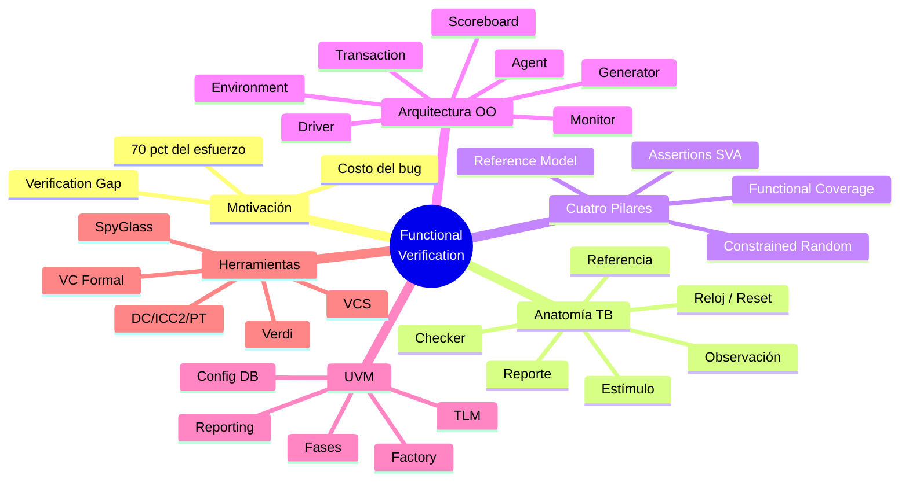

---
layout: default
---

# Preview del Bootcamp

Lo que van a hacer la próxima semana con lo que aprendieron hoy:

<div class="text-sm mt-4">

**Día 1** — Setup del entorno Synopsys, correr su primer TB UVM oficial contra un DUT proporcionado. Ejercicios de `uvm_config_db` y `uvm_report_server`.

**Día 2** — Escribir `uvm_sequence_item`, `uvm_driver`, `uvm_monitor` desde cero. Es el Lab 4 con herencia UVM. Van a decir "esto ya lo hice".

**Día 3** — Sequences: patrones de estímulos, virtual sequences, sequence libraries. Aleatoriedad avanzada.

**Día 4** — Coverage-driven verification: covergroups en UVM, functional coverage cierre, cross coverage, regression con múltiples seeds. Uso de URG.

**Día 5** — Un mini-proyecto: verificar un bloque real (por ejemplo un FIFO o un árbitro), con reporte de coverage y sign-off.

</div>

<div class="mt-4 pro-tip">
El Bootcamp asume todo lo de este propedéutico. Si algo no les quedó claro hoy, este es el momento de preguntar.
</div>

---
layout: default
---

# Cierre

<div class="mt-6 text-lg">

En 6 horas pasaron de:
- **"¿Verification? Eso es agregarle un `initial begin` al Verilog"**

A:
- **"Ah, UVM es el Lab 4 con nombres formales y automatización industrial."**

</div>

<div class="mt-6">

Lo más importante que se llevan:

- **La arquitectura**. Siete piezas, una responsabilidad cada una, mailboxes entre ellas.
- **La disciplina**. Constrained random + coverage + assertions + reference model. Los cuatro pilares.
- **El vocabulario**. Cuando en el Bootcamp digan "sequence_item", "analysis_port", "phase" — no van a estar perdidos.
- **La motivación**. Verification es el 70% del esfuerzo. Es donde están las vacantes. Es donde se ganan (o pierden) los millones.

</div>

<QuestionBox>
Última pregunta: <b>¿tienen alguna duda antes de que cierren la sesión?</b>
</QuestionBox>

---
layout: end
---

# Gracias

## Nos vemos en el Bootcamp

<div class="mt-8 text-sm opacity-70">
Ing. Cesar Otamendi<br/>
CINVESTAV Zacatenco · Departamento de Ingeniería Eléctrica<br/>
Curso propedéutico de Functional Verification · 2026
</div>
